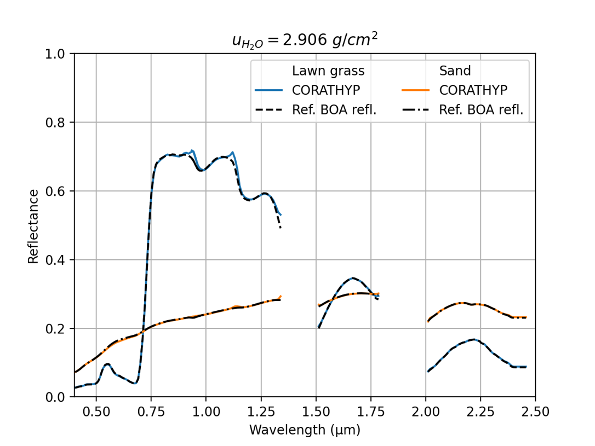

> __Customer__\: Centre National d'Etudes Spatiales (CNES)

> __Programme__\: R&T

> __Supply Chain__\: CNES >  CS Group SPACE

# Context

CS Group responsabilities for Atmospheric correction of hyperspectral data are as follows:
* Specifications, development, validation

The features are as follows:
* State of the art of atmospheric correction methods 
* CORATHYP specifications and design
* Code development in Python in the PERSEUS environment
* Generation of synthetic images with SOS-ABS for validation
* Validation on synthetic, real data and in-situ measurements
* Computer optimization (reduction of calculation time)
* Proposals for algorithmic improvements 
* Creation of a spectral band selection tool to characterize the atmosphere

# Project implementation

The project objectives are as follows:
* Develop an autonomous and modular atmospheric correction code for processing satellite hyperspectral images

The processes for carrying out the project are:
* Bibliography, Specifications, Development, Validation, Studies, Regular progress updates, Reports

# Technical characteristics

The solution key points are as follows:
* Not applicable

The main technologies used in this project are:

{:class="table table-bordered table-dark"}
| Domain | Technology(ies) |
|--------|----------------|
|Programming language(s)|Python, Dask, Pandas|
|Main COTS library(ies)|PERSEUS, SOS-ABS, GDALdem, Shareloc|

{::comment}Abbreviations{:/comment}

*[CLI]: Command Line Interface
*[IaC]: Infrastructure as Code
*[PaaS]: Platform as a Service
*[VM]: Virtual Machine
*[OS]: Operating System
*[IAM]: Identity and Access Management
*[SIEM]: Security Information and Event Management
*[SSO]: Single Sign On
*[IDS]: intrusion detection
*[IPS]: intrusion prevention
*[NSM]: network security monitoring
*[DRMAA]: Distributed Resource Management Application API is a high-level Open Grid Forum API specification for the submission and control of jobs to a Distributed Resource Management (DRM) system, such as a Cluster or Grid computing infrastructure.
