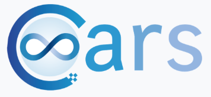

> __Customer__\: Centre National d'Etudes Spatiales (CNES)

> __Programme__\: CO3D

> __Supply Chain__\: CNES >  CS Group SPACE

# Context

CARS allows 3D scenes reconstruction by photogrammetry. The tool will be integrated into the ground segment of the CO3D mission.
The present study aims to improve the denoising of point clouds produced by CARS for the reconstruction of 3D scenes.
A first study was carried out by CS in 2022 to improve the method for denoising point clouds in epipolar geometry. 
This R&T is the continuation of this study, it aims to pursue investigations for improvement and industrialize them via a plugin in CARS.

CS Group responsabilities for Point cloud clearing in epipolar geometry using trusted intervals  are as follows:
* Research and software development

The features are as follows:
* CARS allows 3D reconstruction by photogrammetry, it will be integrated into the ground segment of the CO3D mission.
* This R&T takes the results of the 2022 study conducted by CS and attempts to improve the methode for denoising point clouds generated by CARS for 3D reconstruction. 
* The idea is to work in epipolar geometry.
* The goal is to remove noise while preserving important details, to improve the MNS producted by CARS.
* This study integrates the development of a plugin in CARS.

# Project implementation

The project objectives are as follows:
* Improving CARS point cloud denoising methods
* Improving CARS output MNS
* 3D scene reconstruction by photogrammetry

The processes for carrying out the project are:
* Agile

# Technical characteristics

The solution key points are as follows:
* Gitlab

The main technologies used in this project are:

{:class="table table-bordered table-dark"}
| Domain | Technology(ies) |
|--------|----------------|
|Operating System(s)|Linux|
|Programming language(s)|Python|
|Production software (IDE, DEVOPS etc.)|Git, CARS, SLURP|

{::comment}Abbreviations{:/comment}

*[CLI]: Command Line Interface
*[IaC]: Infrastructure as Code
*[PaaS]: Platform as a Service
*[VM]: Virtual Machine
*[OS]: Operating System
*[IAM]: Identity and Access Management
*[SIEM]: Security Information and Event Management
*[SSO]: Single Sign On
*[IDS]: intrusion detection
*[IPS]: intrusion prevention
*[NSM]: network security monitoring
*[DRMAA]: Distributed Resource Management Application API is a high-level Open Grid Forum API specification for the submission and control of jobs to a Distributed Resource Management (DRM) system, such as a Cluster or Grid computing infrastructure.
