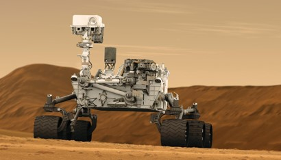
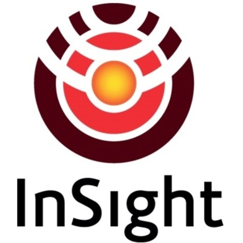

> __Customer__\: Centre National d'Etudes Spatiales (CNES)

> __Programme__\: Interplanetary

> __Supply Chain__\: CNES >  CS Group SPACE

# Context

CS Group responsabilities for Maintenance of SISMOC and Fimoc mission centers are as follows:
* Maintenance and developments, support

The features are as follows:
* Operational centers 24 hours a day
* Mission centers designed around a common nucleus: SAG
* Surveillance and programming of instruments
* Data exchange with JPL
* Long -term archiving
* Processing and distribution of scientific data

# Project implementation

The project objectives are as follows:
* Corrective and evolutive maintenance of the following mission centers
	**SISMOC**: SEIS and APSS instruments of the INSIGHT mission
	**FIMOC**: SAM and CHEMCAM instruments of the MSL mission
	**Martian missions** whose instruments above are operated by CNES and JPL

The processes for carrying out the project are:
* V Cycle

# Technical characteristics

The solution key points are as follows:
* Complete virtualization of mission centers
* Pooling of skills between the 2 mission centers

The main technologies used in this project are:

{:class="table table-bordered table-dark"}
| Domain | Technology(ies) |
|--------|----------------|
|Operating System(s)|Linux 64 Bits|
|Programming language(s)|Java, Python, ecore|
|Interoperability (protocols, format, APIs)|SISMOC Core, ISATIS-NG, TCT, CONFGEN, EBM/ERP, FIMOC Core, FIMOC Web, IMIS|
|Production software (IDE, DEVOPS etc.)|SAG|
|Main COTS library(ies)|WorldWindJava, EMF, PostGreSQL, OpenLdap, Torque, Samba|

{::comment}Abbreviations{:/comment}

*[CLI]: Command Line Interface
*[IaC]: Infrastructure as Code
*[PaaS]: Platform as a Service
*[VM]: Virtual Machine
*[OS]: Operating System
*[IAM]: Identity and Access Management
*[SIEM]: Security Information and Event Management
*[SSO]: Single Sign On
*[IDS]: intrusion detection
*[IPS]: intrusion prevention
*[NSM]: network security monitoring
*[DRMAA]: Distributed Resource Management Application API is a high-level Open Grid Forum API specification for the submission and control of jobs to a Distributed Resource Management (DRM) system, such as a Cluster or Grid computing infrastructure.
