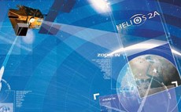

> __Customer__\: Centre National d'Etudes Spatiales (CNES)

> __Programme__\: Spot Helios

> __Supply Chain__\: CNES >  CS Group SPACE

# Context

CS Group responsabilities for Software maintenance of CMP SPOT and HELIOS (Post Maintenance Center) are as follows:
* bonus on fixed price TMA (project management and quality, technical coordination management of the IT platform, configuration management)

The features are as follows:
* Management and implementation of developments
* Corrective maintenance
* Daily operations and on-call support in the event of an operational emergency
* Maintenance, since 2007, of the CCS (Control Center) which is the real-time component of the CMP
* User training

# Project implementation

The project objectives are as follows:
* Level 3 software maintenance for CMP SPOT and HELIOS

The processes for carrying out the project are:
* V Cycle

# Technical characteristics

The solution key points are as follows:
* functional architecture of software components
* maintaining skills and component testing environments over a very long period

The main technologies used in this project are:

{:class="table table-bordered table-dark"}
| Domain | Technology(ies) |
|--------|----------------|
|Hardware environment(s)|VMWare|
|Operating System(s)|HP-UX, RedHat|
|Programming language(s)|C, C++, ADA, Fortran, Java, Perl, Tcl/Tk, Python, Shell, SQL, awk|
|Production software (IDE, DEVOPS etc.)|SVN|
|Main COTS library(ies)|IlogViews, X11/Motif, Oracle|

{::comment}Abbreviations{:/comment}

*[CLI]: Command Line Interface
*[IaC]: Infrastructure as Code
*[PaaS]: Platform as a Service
*[VM]: Virtual Machine
*[OS]: Operating System
*[IAM]: Identity and Access Management
*[SIEM]: Security Information and Event Management
*[SSO]: Single Sign On
*[IDS]: intrusion detection
*[IPS]: intrusion prevention
*[NSM]: network security monitoring
*[DRMAA]: Distributed Resource Management Application API is a high-level Open Grid Forum API specification for the submission and control of jobs to a Distributed Resource Management (DRM) system, such as a Cluster or Grid computing infrastructure.
