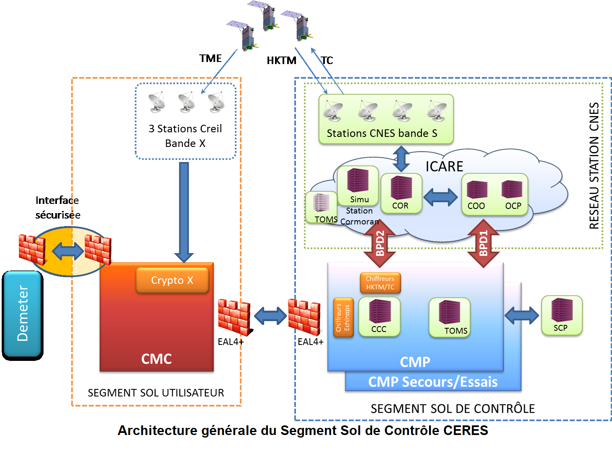
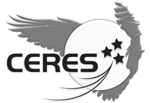

> __Customer__\: Centre National d'Etudes Spatiales (CNES)

> __Programme__\: CERES

> __Supply Chain__\: CNES >  CS Group SPACE

# Context

CS Group responsabilities for SSC IVV, support in Technical and Operational Qualification and LEOP of CERES mission are as follows:
* * Piloting of the IVV by CS GROUP, TQ/OQ tests by CNES

The features are as follows:
* **AIV **: Development of LDP procedures and missionary, definition of strategy, automated plans and execution of tests (AIV tools for managing contexts, results, requirements)
	**QT/QO ** system tests: preparation and support for the execution of compatibility/qt/qo tests, development of operational procedures
	**Support for operations **: Resources integrated in CNES teams for launch, the recipe in flight and beginning of life (shifts, soil clips)

# Project implementation

The project objectives are as follows:
* Assistance to engineering and support for the realization of ** Integration and System Qualification ** of the components of the ** Segments Control of the Ceres ** Satellites ** the ** Line of Isis products**
* First missionary and integration of the ISIS LDP
* Defense context: strong security constraints

The processes for carrying out the project are:
* Requirements management (STB, IF): Testlink and Excel
* Specific assembly process, integration, validation qualification of control soil segments
* Tests qualification system for control soil segments: compatibility, technical and operational qualification

# Technical characteristics

The solution key points are as follows:
* Configuration and deployment of SSCs: nominal, rescue, SCP/SSV (experts) and 10 test lines
* 1st operational qualification channel TM/TC Isis: BDS configurations, sessions, SLE, COP, Catalogs, TM visualization, TC Histo
* 1st implementation of ISIS operational concepts: procedures, automation 
* Experienced AIV team including experts

The main technologies used in this project are:

{:class="table table-bordered table-dark"}
| Domain | Technology(ies) |
|--------|----------------|
|Hardware environment(s)|Esx Dell, SAN, Appliance Netbackup, HP Thin Pro, switch, firewall, BPD, chiffreur/déchiffreur TC/TM|
|Operating System(s)|Red Hat 7.5, VMWare, NoMachine,  PXE|
|Programming language(s)|Python, Bash|
|Interoperability (protocols, format, APIs)|XML, XTCE, Jason, CCSDS,  standard CNES XIF|
|Production software (IDE, DEVOPS etc.)|TestLink, Git, Ansible|
|Main COTS library(ies)|Ldap, IDM, ZeroMQ, SGDB|

{::comment}Abbreviations{:/comment}

*[CLI]: Command Line Interface
*[IaC]: Infrastructure as Code
*[PaaS]: Platform as a Service
*[VM]: Virtual Machine
*[OS]: Operating System
*[IAM]: Identity and Access Management
*[SIEM]: Security Information and Event Management
*[SSO]: Single Sign On
*[IDS]: intrusion detection
*[IPS]: intrusion prevention
*[NSM]: network security monitoring
*[DRMAA]: Distributed Resource Management Application API is a high-level Open Grid Forum API specification for the submission and control of jobs to a Distributed Resource Management (DRM) system, such as a Cluster or Grid computing infrastructure.
