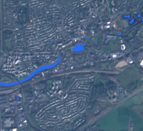
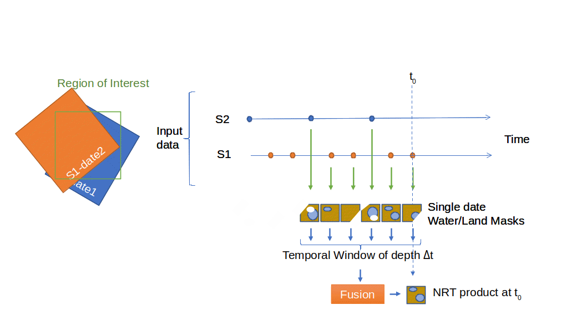

> __Customer__\: Centre National d'Etudes Spatiales (CNES)

> __Programme__\: SWOT

> __Supply Chain__\: CNES >  CS Group SPACE

# Context

CS Group responsabilities for Surfwater, dynamic monitoring of water surfaces are as follows:
* Specification, design, development, maintenance
* Calibration and validation

The features are as follows:
* Time series processing
* Near real-time product delivery for continuous water surface monitoring (new SW product for each S1/S2 product made available) and evolution assessment.
* Monthly synthesis product: water occurrence map
* Combined processing of Sentinel 1 and 2 data for both high-frequency monitoring and heterogeneous information for better water occurrence detection.
* NRT processing based on ‘incremental methodology’ using previous NRT product collectively with last Sentinel data instead of reprocessing the whole temporal series
* Both desktop and HPC applications sharing the same algorithm implementation.

# Project implementation

The project objectives are as follows:
* Specify, design and assess a water surface detection processing chain.
* Make use of Sentinel-1 and Sentinel-2 data in order to provide continental water surface evolution monitoring.

The processes for carrying out the project are:
* Agile

# Technical characteristics

The solution key points are as follows:
* Continuous benchmarking and quality assessment using ‘Continuous Integration’ approach
* Automatic performance report generation
* Calibration / Validation based on quality metrics and high quality reference data over various well selected test sites for robustness evaluation

The main technologies used in this project are:

{:class="table table-bordered table-dark"}
| Domain | Technology(ies) |
|--------|----------------|
|Hardware environment(s)|Linux 64 bits, HPC, workstation|
|Operating System(s)|Red Hat 7|
|Programming language(s)|Python (v3.x), C++, Java, Markdown|
|Interoperability (protocols, format, APIs)|OpenSearch Geo & Time, WMS, WPS, WCS, CLI, SDK Python, REST Interfaces|
|Production software (IDE, DEVOPS etc.)|Pylint, PBS Pro (parallel processing on HPC)|

{::comment}Abbreviations{:/comment}

*[CLI]: Command Line Interface
*[IaC]: Infrastructure as Code
*[PaaS]: Platform as a Service
*[VM]: Virtual Machine
*[OS]: Operating System
*[IAM]: Identity and Access Management
*[SIEM]: Security Information and Event Management
*[SSO]: Single Sign On
*[IDS]: intrusion detection
*[IPS]: intrusion prevention
*[NSM]: network security monitoring
*[DRMAA]: Distributed Resource Management Application API is a high-level Open Grid Forum API specification for the submission and control of jobs to a Distributed Resource Management (DRM) system, such as a Cluster or Grid computing infrastructure.
