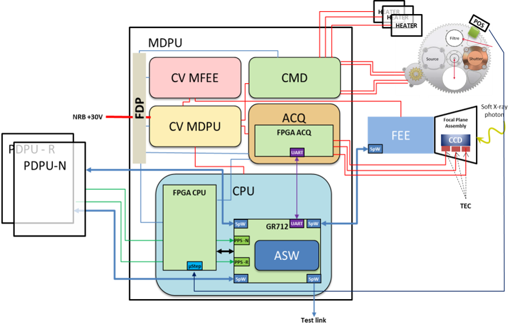

> __Customer__\: Centre National d'Etudes Spatiales (CNES)

> __Programme__\: SVOM

> __Supply Chain__\: CNES >  CS Group SPACE

# Context

The SVOM satellite (Space-based multi-band astronomical Variable Objects Monitor) is dedicated to the detection, localization and study of Gamma-Ray Bursts (GRBs) and other high-energy transient phenomena
MXT is one of the two instruments composing the SVOM French payload. It is specialized in GRB follow-up observation using a X-ray sensitive camera composed of a detector and a Front End Electronic (FEE) to detect and image X-ray photons in the 0.2keV – 10keV energy band
Data observation are processed to achieve source localization, cosmic ray rejection and detector calibration.

CS Group responsabilities for MXT instrument Software embedded into the SVOM satellite are as follows:
* Design, Development, Integration

The features are as follows:
* Platform (PDPU) and camera (FEE) interfaces (Spacewire links)
* Telecommand execution and telemetry generation (VHF, S-band and X-band)
* Functional modes
* Camera power supply
* Camera mechanism (shutter)
* Thermal control and regulation
* Monitoring and fault detection, isolation and recovery 
* Science data processing (partition provided by the French laboratory LAL)

# Project implementation

The project objectives are as follows:
* **MXT** is one of the 2 instruments of the **SVOM** French payload. It is specialized in GRB follow-up observation
* CS GROUP had to provide the MXT instrument Application Software embedded into the Data Processing Unit (MDPU) in charge of managing

The processes for carrying out the project are:
* V Cycle, ECSS Level B and C

# Technical characteristics

The solution key points are as follows:
* Software based on LVCUGEN, a Time and Space Partitioning (TSP) solution, and LibPus, an ESA Packet Utilization Standard (PUS) library, both of them industrialized by internal software teams.

The main technologies used in this project are:

{:class="table table-bordered table-dark"}
| Domain | Technology(ies) |
|--------|----------------|
|Hardware environment(s)|GR712RC Dual-Core LEON3FT, Spacewire links|
|Main COTS library(ies)|LVCUGEN (TSP-based solution), LibPus library|

{::comment}Abbreviations{:/comment}

*[CLI]: Command Line Interface
*[IaC]: Infrastructure as Code
*[PaaS]: Platform as a Service
*[VM]: Virtual Machine
*[OS]: Operating System
*[IAM]: Identity and Access Management
*[SIEM]: Security Information and Event Management
*[SSO]: Single Sign On
*[IDS]: intrusion detection
*[IPS]: intrusion prevention
*[NSM]: network security monitoring
*[DRMAA]: Distributed Resource Management Application API is a high-level Open Grid Forum API specification for the submission and control of jobs to a Distributed Resource Management (DRM) system, such as a Cluster or Grid computing infrastructure.
