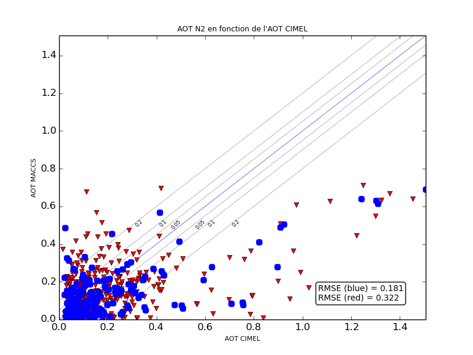

> __Customer__\: Centre National d'Etudes Spatiales (CNES)

> __Programme__\: R&T

> __Supply Chain__\: CNES >  CS Group SPACE

# Context

CS Group responsabilities for Validation of THEIA Level 2 products are as follows:
* Validation

The features are as follows:
* **Validation of AOT :**
* SPOT 5/ Take 5 data processing / Comparison with SPOT4 Take 5
* Analysis of results by AERONET site: identification of the most reliable sites
	**Anomaly detection on time series :**
* Processing of 4 time series: Toulouse, Beijing, Moroccan Desert, Australia
* Sensitivity study: analysis of anomaly detections depending on the settings and the type of anomaly
* Development of graphical analysis tools
* Proposal for algorithmic improvements

# Project implementation

The project objectives are as follows:
* Validate / configure 2 tools: validation of AOT & detection of anomalies on time series

The processes for carrying out the project are:
* Validation, Analysis, Regular progress updates, Reports

# Technical characteristics

The solution key points are as follows:
* Not applicable

The main technologies used in this project are:

{:class="table table-bordered table-dark"}
| Domain | Technology(ies) |
|--------|----------------|
|Programming language(s)|Python|
|Main COTS library(ies)|THEIA|

{::comment}Abbreviations{:/comment}

*[CLI]: Command Line Interface
*[IaC]: Infrastructure as Code
*[PaaS]: Platform as a Service
*[VM]: Virtual Machine
*[OS]: Operating System
*[IAM]: Identity and Access Management
*[SIEM]: Security Information and Event Management
*[SSO]: Single Sign On
*[IDS]: intrusion detection
*[IPS]: intrusion prevention
*[NSM]: network security monitoring
*[DRMAA]: Distributed Resource Management Application API is a high-level Open Grid Forum API specification for the submission and control of jobs to a Distributed Resource Management (DRM) system, such as a Cluster or Grid computing infrastructure.
