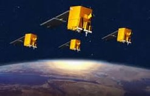

> __Customer__\: Centre National d'Etudes Spatiales (CNES)

> __Programme__\: Generic

> __Supply Chain__\: CNES >  CS Group SPACE

# Context

Development and maintenance of  Space Mechanics Centre (CMS in French). **Two CMS ADEL** model have been fully developped by CS : 
PICARD mission for sun observation,
ELISA mission for military purpose.
Current status : Since 2012 , CS insures the maintenance of all the CMS either in operation or in development on behalf of the CNES
Challenges : Service continuity for a very long time period for the development and the maintenance of CMS. Competent and reactive support to Client’s requests.
**ACDV workload 2006-2011** : 
Period : 5 years, Efforts : 360 workers * month, Team size : 6 workers, Affected missions : Parasol, Demeter, Essor, Picard, Elisa
**ACIS workload since 2011** :
Period : 4 years, renewable every 2 years, Team size : 6 workers, Affected missions : (Parasol, Picard, Elisa, Taranis, Microscope), (Corot, Calipso, SMOS, Jason 1, Jason 2-3), (Spot 5, Helios 2A, Helios 2B), (PHR1A, PHR1B)

CS Group responsabilities for Space Mechanics Center Maintenance are as follows:
* Development and maintenance of CMS software. From 2012, CS ensured the maintenance of all CMS in operation or under development on behalf of CNES

The features are as follows:
* External files comsuption and preprocessing,
* Orbit restitution,
* Manœuvre results,
* Station keeping manœuvre computation,
* Orbital, sensor, station, satellite event determination,
* Telecommand generation,
* Generation of ephemeris

# Project implementation

The project objectives are as follows:
* Due the the spin-off of a high number of minisatellites in the 2000s , the CNES wanted to simplify the CMS implementation by means of generic and reusable packages to avoid duplicity of identical functionalities.

The processes for carrying out the project are:
* V Cycle

# Technical characteristics

The solution key points are as follows:
* CMSG “Centre de Mécanique Spatiale Générique” (used as an external product): Generic functionalities of space mechanics. 
* ISM "Specific Mission Interface": Generation/consumption from external interfaces and generation of mission event chronograms.
* GTC “Remote Control Generator”: Functions for generating remote controls

The main technologies used in this project are:

{:class="table table-bordered table-dark"}
| Domain | Technology(ies) |
|--------|----------------|
|Hardware environment(s)|PC Linux, HP-UX|
|Operating System(s)|RedHat Enterprise 4/5, CentOS|
|Programming language(s)|Fortran 77/90, C, XML, KSHELL|
|Production software (IDE, DEVOPS etc.)|Subversion, Smart SVN, TortoiseSVN, FORCHECK, FORESYS (CNES), RSM, GCOV|
|Main COTS library(ies)|GENESIS, MADONA, DIAMS, MSLIB (librairies CNES )|

{::comment}Abbreviations{:/comment}

*[CLI]: Command Line Interface
*[IaC]: Infrastructure as Code
*[PaaS]: Platform as a Service
*[VM]: Virtual Machine
*[OS]: Operating System
*[IAM]: Identity and Access Management
*[SIEM]: Security Information and Event Management
*[SSO]: Single Sign On
*[IDS]: intrusion detection
*[IPS]: intrusion prevention
*[NSM]: network security monitoring
*[DRMAA]: Distributed Resource Management Application API is a high-level Open Grid Forum API specification for the submission and control of jobs to a Distributed Resource Management (DRM) system, such as a Cluster or Grid computing infrastructure.
