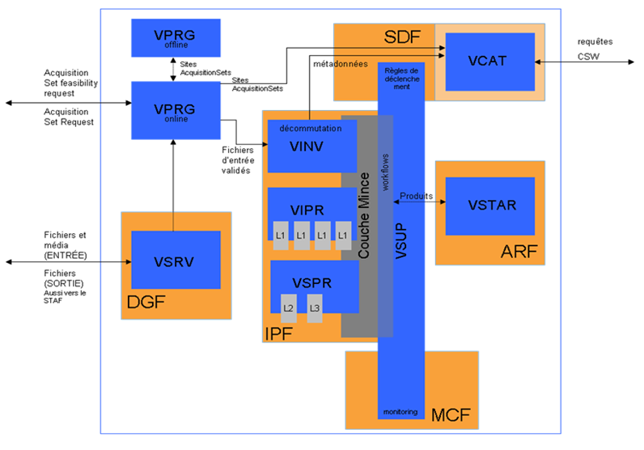

> __Customer__\: Centre National d'Etudes Spatiales (CNES)

> __Programme__\: Venμs

> __Supply Chain__\: CNES >  CS Group SPACE

# Context

CS Group responsabilities for Maintenance of the Venµs Image Quality (VIP) center are as follows:
* Maintenance of the data center (VIP), the distribution server (VPDS), the qalification and operation support tools within the VEnµS ground segment

The features are as follows:
* Upgrade of COTS, image libraries and missions used by the center,
* Functional validation of the VIP center and VPDS,
* Integration of the PDS component developed by ACS, 
* VIP Integration / Validation,
* Dimensioning of the hardware architecture and its upgrade,
* QT/QO phase support,
* Evolutive and Corrective maintenance during the mission,

# Project implementation

The project objectives are as follows:
* Delivering an operational VIP/VPDS image processing center that takes into account the constraints of the VENµS mission during the operational phase.

The processes for carrying out the project are:
* Development and continuous integration (coding/unit tests)

# Technical characteristics

The solution key points are as follows:
* Integration of the MACCS (image processor level L2/L3°) component,
* The image chain has taken into account the processing of stray light in the image processing chain (level L1).

The main technologies used in this project are:

{:class="table table-bordered table-dark"}
| Domain | Technology(ies) |
|--------|----------------|
|Operating System(s)|Linux  CentOS 6.5|
|Programming language(s)|JAVA,JAVASCRIPT, C,C++, Python, PHP, SQL, SWING, ksh,HTML|
|Interoperability (protocols, format, APIs)|XML|
|Main COTS library(ies)|LAI (Euclide, POLLUX, MARIO, GDAL), PHRLIB , MSLIB|

{::comment}Abbreviations{:/comment}

*[CLI]: Command Line Interface
*[IaC]: Infrastructure as Code
*[PaaS]: Platform as a Service
*[VM]: Virtual Machine
*[OS]: Operating System
*[IAM]: Identity and Access Management
*[SIEM]: Security Information and Event Management
*[SSO]: Single Sign On
*[IDS]: intrusion detection
*[IPS]: intrusion prevention
*[NSM]: network security monitoring
*[DRMAA]: Distributed Resource Management Application API is a high-level Open Grid Forum API specification for the submission and control of jobs to a Distributed Resource Management (DRM) system, such as a Cluster or Grid computing infrastructure.
