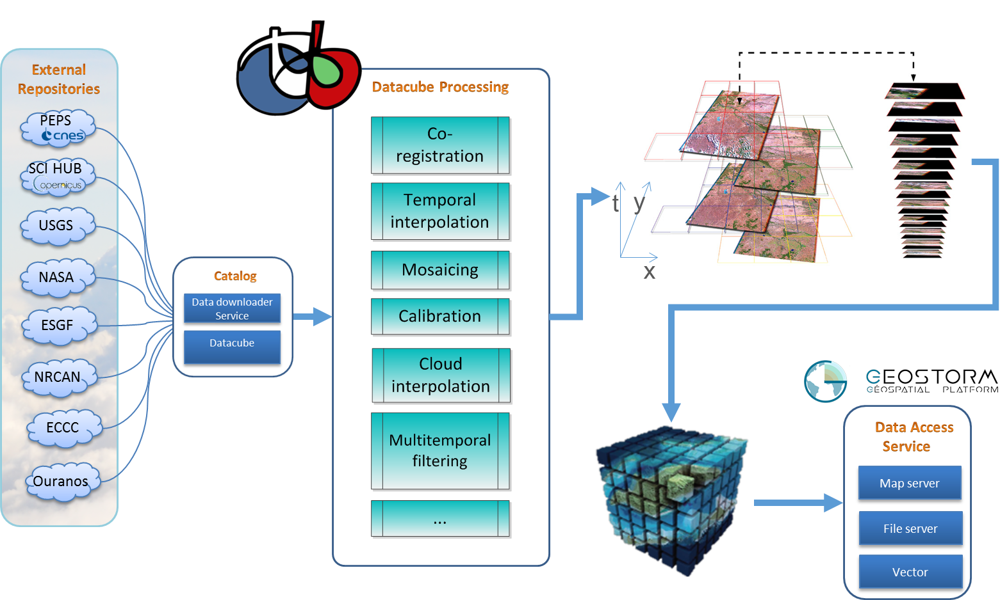
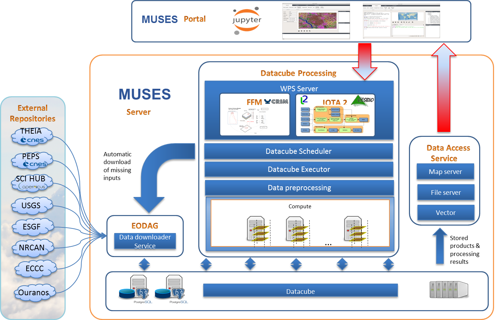

> __Customer__\: Canadian Space Agency (CSA)

> __Programme__\: Radarsat

> __Supply Chain__\: CSA > CS CANADA >  CS Group SPACE

# Context

CS Group responsabilities for MUltisensor value-added products and Services from satellite temporal sEries analysiS are as follows:
* Datacube development.
* Sentinel-1/2 Land cover map prototype (from IOTA² library and CRIM methods).
* Flood risk assessment product.

The features are as follows:
* Optimization (and automation when possible) of Data Searching and Harvesting 
* Reduction of processing times (data access, calculation,production bottlenecks mitigation…)
* Ingestion and preparation of input data to L2A level (Sen2Cor or MAJA algorithms) then ARD standard
* Data pre-processing and preparation using common reference data (Sentinel 2 by default)
* Steering functions at Datacube level: starting production, informing operators and users of data availability, management of parallelization and scalability, of processing chains, visualization of intermediate results and confidence indices, dissemination…

# Project implementation

The project objectives are as follows:
* Management of the full cycle of EO data from search, collection, storage and access to dissemination (Copernicus, Radarsat/RCM…)
* Optimized processing and analysis chains and services managing volume and heterogeneity of data 
* Methods for analysis and classification of radar/optical time series based on deep learning technologies and Dempster Shafer approach

The processes for carrying out the project are:
* Agile

# Technical characteristics

The solution key points are as follows:
* Optimized system architecture, based on Open Source components
* Datacube: optimisation (and automation) of acquisition, pre-processing and data preparation operations => ARD data
* Machine learning for Land Use Classification of Sentinel-1/2 Data (adapted from IOTA² library)
* Dempster-Shafer approach for fusion of IOTA² and Radarsat time series land cover maps

The main technologies used in this project are:

{:class="table table-bordered table-dark"}
| Domain | Technology(ies) |
|--------|----------------|
|Hardware environment(s)|High Performance Computing (cluster ready)|
|Operating System(s)|Unix, Linux_Ubuntu, CentOS|
|Programming language(s)|Python, C++|
|Interoperability (protocols, format, APIs)|OpenSearch Geo & Time, WMS, WPS, WCS, CLI, SDK Python, REST Interfaces|
|Main COTS library(ies)|Jupyter notebook, Open Datacube (ODC), OTB, GDAL, PostgreSQL, Xarray, Dask|

{::comment}Abbreviations{:/comment}

*[CLI]: Command Line Interface
*[IaC]: Infrastructure as Code
*[PaaS]: Platform as a Service
*[VM]: Virtual Machine
*[OS]: Operating System
*[IAM]: Identity and Access Management
*[SIEM]: Security Information and Event Management
*[SSO]: Single Sign On
*[IDS]: intrusion detection
*[IPS]: intrusion prevention
*[NSM]: network security monitoring
*[DRMAA]: Distributed Resource Management Application API is a high-level Open Grid Forum API specification for the submission and control of jobs to a Distributed Resource Management (DRM) system, such as a Cluster or Grid computing infrastructure.
