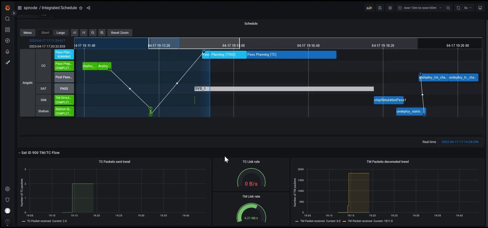
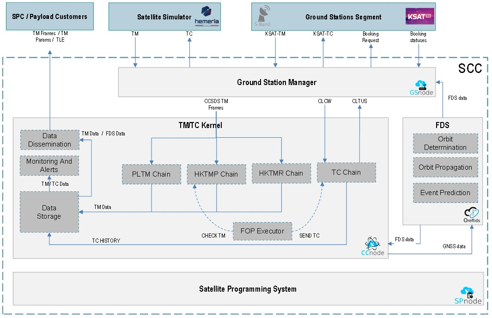

> __Customer__\: CS Group (CSGROUP)

> __Programme__\: GOSMIC

> __Supply Chain__\: CSGROUP >  CS Group SPACE

# Context

ASTROID is a France Relance project and aims to boost the market access of 8 nanosatellite technologies resulting from French R&D, thanks to a first in-orbit demonstration, a consortium approach and the international promotion of the results acquired for each partner.

CS Group responsabilities for Demonstration of satellite and Control Centre are as follows:
* Design, development, intégration, maintenance & operation

The features are as follows:
* ASTROID (Advanced Satellite Technology, Radio Occultation and IoD Demonstrator) :
*     It is the first project to use GOSMIC products:
*     CSNano (Control Center) and SPnode (Scheduler)
*     OREFLIDS (Flight Dynamics System)

# Project implementation

The project objectives are as follows:
* ASTROID consists of testing in orbit on an HEMERIA nano-satellite platform the equipment and technological solutions of 6 partners (ANYWAVES, COMAT, CSGROUP, MECANO-ID, STEEL & SYNTONY) in order to qualify them in an operational environment.

The processes for carrying out the project are:
* Agile

# Technical characteristics

The solution key points are as follows:
* Cloud native (Kubernetes) Micro-services architecture

The main technologies used in this project are:

{:class="table table-bordered table-dark"}
| Domain | Technology(ies) |
|--------|----------------|
|Hardware environment(s)|Kubernetes|
|Operating System(s)|Linux, Windows (client)|
|Programming language(s)|Java, Python, Javascript|
|Interoperability (protocols, format, APIs)|API REST, JSON, YAML|
|Production software (IDE, DEVOPS etc.)|CSNANO, OREFLIDS, SPNODE|

{::comment}Abbreviations{:/comment}

*[CLI]: Command Line Interface
*[IaC]: Infrastructure as Code
*[PaaS]: Platform as a Service
*[VM]: Virtual Machine
*[OS]: Operating System
*[IAM]: Identity and Access Management
*[SIEM]: Security Information and Event Management
*[SSO]: Single Sign On
*[IDS]: intrusion detection
*[IPS]: intrusion prevention
*[NSM]: network security monitoring
*[DRMAA]: Distributed Resource Management Application API is a high-level Open Grid Forum API specification for the submission and control of jobs to a Distributed Resource Management (DRM) system, such as a Cluster or Grid computing infrastructure.
