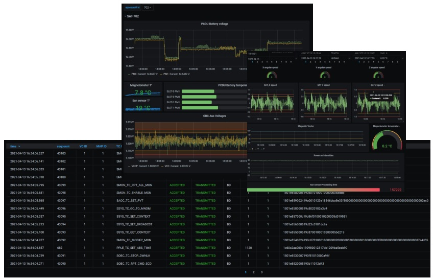
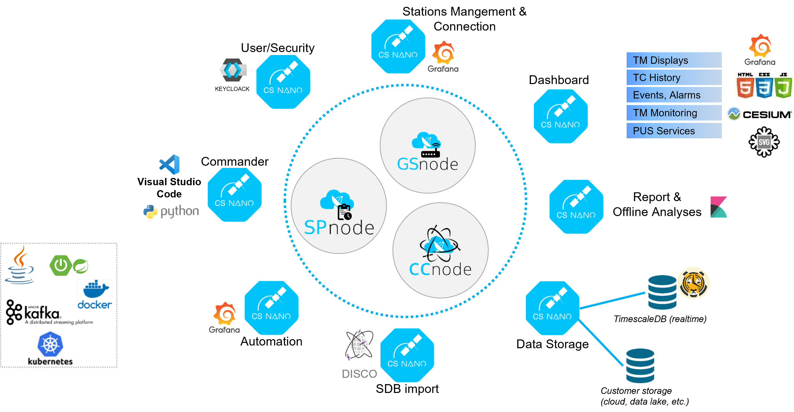

> __Customer__\: CS GROUP (CSGROUP)

> __Programme__\: GOSMIC

> __Supply Chain__\: CSGROUP >  CS Group SPACE

# Context

CS Group responsabilities for Satellites Control Center are as follows:
* Design, development, intégration & maintenance

The features are as follows:
* Operationnal Dashboards : Based on Grafana for TM/TC and system monitoring 
* Telemetry Chain Processings : TM Acquisition, Processing and Distribution
* Command Chain : TC Encoding, COP-1 Management, TC History
* PUS Services : Dedicated monitoring views. Compliant with ECSS PUS 41A standards.
* Monitoring & Control of Ground Stations and Simulators : Management of RM/RC, RMS/RCS.

# Project implementation

The project objectives are as follows:
* The CSNano Satellite Control Center is designed as a set of micro-services providing features required to monitor and control satellites.
* Ground Stations Management & Connection (SLE, KSat)
* Compliant with CCSDS SDLP/SDLSP standards

The processes for carrying out the project are:
* Agile

# Technical characteristics

The solution key points are as follows:
* Cloud native (Kubernetes) Micro-services architecture

The main technologies used in this project are:

{:class="table table-bordered table-dark"}
| Domain | Technology(ies) |
|--------|----------------|
|Hardware environment(s)|Kubernetes|
|Operating System(s)|Linux, Windows (client)|
|Programming language(s)|Java, Python, Javascript|
|Interoperability (protocols, format, APIs)|API REST, JSON, YAML|
|Production software (IDE, DEVOPS etc.)|TimeScaleDB, Kafka, Grafana|

{::comment}Abbreviations{:/comment}

*[CLI]: Command Line Interface
*[IaC]: Infrastructure as Code
*[PaaS]: Platform as a Service
*[VM]: Virtual Machine
*[OS]: Operating System
*[IAM]: Identity and Access Management
*[SIEM]: Security Information and Event Management
*[SSO]: Single Sign On
*[IDS]: intrusion detection
*[IPS]: intrusion prevention
*[NSM]: network security monitoring
*[DRMAA]: Distributed Resource Management Application API is a high-level Open Grid Forum API specification for the submission and control of jobs to a Distributed Resource Management (DRM) system, such as a Cluster or Grid computing infrastructure.
