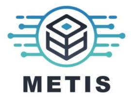
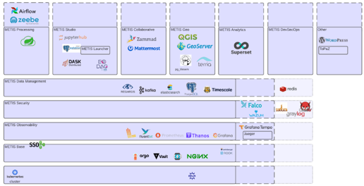

> __Customer__\: CS GROUP (CSGROUP)

> __Programme__\: METIS

> __Supply Chain__\: CSGROUP >  CS Group SPACE

# Context

CS Group responsabilities for Cloud platform solution are as follows:
* Design, development, integration, deployement & maintenance

The features are as follows:
* Quickly and easily deploy a production grade cloud platform. 
* Provide a complete ecosystem to facilitate platform development and deployment 
* Access management
* Observability
* Data management capabilities
* Business capabilities.

# Project implementation

The project objectives are as follows:
* METIS is a powerful solution to quickly and easily deploy a production grade cloud platform. It is designed to provide a complete ecosystem to facilitate platform development and deployment.

The processes for carrying out the project are:
* Templating, Consulting

# Technical characteristics

The solution key points are as follows:
* Kubernetes

The main technologies used in this project are:

{:class="table table-bordered table-dark"}
| Domain | Technology(ies) |
|--------|----------------|
|Main COTS library(ies)|ArgoCD, Prometheus, Loki, Grafana, Neuvector|

{::comment}Abbreviations{:/comment}

*[CLI]: Command Line Interface
*[IaC]: Infrastructure as Code
*[PaaS]: Platform as a Service
*[VM]: Virtual Machine
*[OS]: Operating System
*[IAM]: Identity and Access Management
*[SIEM]: Security Information and Event Management
*[SSO]: Single Sign On
*[IDS]: intrusion detection
*[IPS]: intrusion prevention
*[NSM]: network security monitoring
*[DRMAA]: Distributed Resource Management Application API is a high-level Open Grid Forum API specification for the submission and control of jobs to a Distributed Resource Management (DRM) system, such as a Cluster or Grid computing infrastructure.
