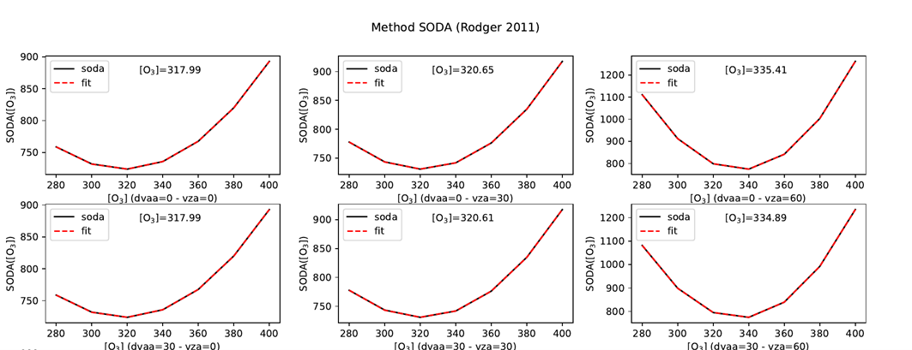

> __Customer__\: CS GROUP (PIE) (CSGROUP)

> __Programme__\: R&T

> __Supply Chain__\: CSGROUP >  CS Group SPACE

# Context

CS Group responsabilities for Evaluation of the SODA method to characterize gaseous content in the atmosphere are as follows:
* Prototype development and results analysis

The features are as follows:
* **Development of a prototype :**
* Atmospheric correction with SOS-ABS for different gas content
* Soda coefficient calculations with two different methods 
* Estimation of optimal content for each gas considered
	**Results analysis :**
* Generation of a database to be treated from SOS-ABS for 9 different surfaces
* Selection of the optimal spectral interval for each gas
* Analysis of results as a function of the surface type

# Project implementation

The project objectives are as follows:
* Evaluate a water vapor inversion method to restore other gas content (O3, CO2, CH4, PSURF)

The processes for carrying out the project are:
* Bibliography, prototyping, simulations, analysis

# Technical characteristics

The solution key points are as follows:
* Incommensurate

The main technologies used in this project are:

{:class="table table-bordered table-dark"}
| Domain | Technology(ies) |
|--------|----------------|
|Programming language(s)|Python, Dask, QSUB|
|Main COTS library(ies)|SOS-ABS|

{::comment}Abbreviations{:/comment}

*[CLI]: Command Line Interface
*[IaC]: Infrastructure as Code
*[PaaS]: Platform as a Service
*[VM]: Virtual Machine
*[OS]: Operating System
*[IAM]: Identity and Access Management
*[SIEM]: Security Information and Event Management
*[SSO]: Single Sign On
*[IDS]: intrusion detection
*[IPS]: intrusion prevention
*[NSM]: network security monitoring
*[DRMAA]: Distributed Resource Management Application API is a high-level Open Grid Forum API specification for the submission and control of jobs to a Distributed Resource Management (DRM) system, such as a Cluster or Grid computing infrastructure.
