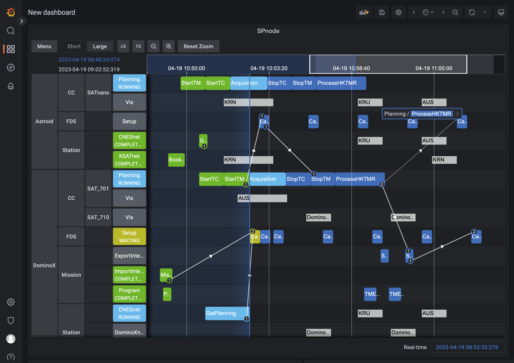

> __Customer__\: CS GROUP (CSGROUP)

> __Programme__\: GOSMIC

> __Supply Chain__\: CSGROUP >  CS Group SPACE

# Context

CS Group responsabilities for Scheduler are as follows:
* Design, development, intégration & maintenance

The features are as follows:
* Real-time display of the activity schedule
* Synthesis view of activities
* Advanced filtering of displayed elements
* Parallel execution of activities in processing lanes
* Scheduling of activity start-up (At given date/time, Following another activity, Conditional on other activities and resources)
* An activity can schedule other activities/events
* Pause/restart/resume of processing lanes and Time Control
* Investigations on the status of activities

# Project implementation

The project objectives are as follows:
* SPNode schedules and orchestrates all the functions of the Satellite Control Center. 
* It allows to completely automate operations with activities and events. 
* It is designed to manage big number of activities.
* It is not specific to Satellite Control Centers and can be used in any context.

The processes for carrying out the project are:
* Agile

# Technical characteristics

The solution key points are as follows:
* Backend: Cloud native (Kubernetes), HA scalable microservices architecture
* Frontend: Web application in Grafana

The main technologies used in this project are:

{:class="table table-bordered table-dark"}
| Domain | Technology(ies) |
|--------|----------------|
|Hardware environment(s)|Kubernetes|
|Operating System(s)|Linux, Windows (client)|
|Programming language(s)|Java, Javascript|
|Interoperability (protocols, format, APIs)|API REST, YAML, Python|
|Production software (IDE, DEVOPS etc.)|Grafana|
|Main COTS library(ies)|Spring, React|

{::comment}Abbreviations{:/comment}

*[CLI]: Command Line Interface
*[IaC]: Infrastructure as Code
*[PaaS]: Platform as a Service
*[VM]: Virtual Machine
*[OS]: Operating System
*[IAM]: Identity and Access Management
*[SIEM]: Security Information and Event Management
*[SSO]: Single Sign On
*[IDS]: intrusion detection
*[IPS]: intrusion prevention
*[NSM]: network security monitoring
*[DRMAA]: Distributed Resource Management Application API is a high-level Open Grid Forum API specification for the submission and control of jobs to a Distributed Resource Management (DRM) system, such as a Cluster or Grid computing infrastructure.
