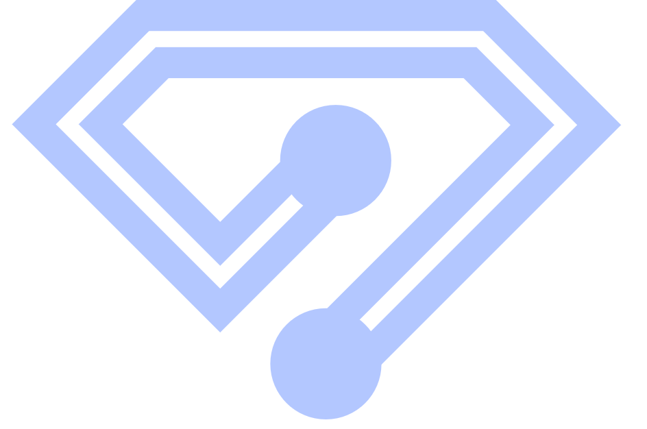

> __Customer__\: CS GROUP (CSGROUP)

> __Programme__\: TOPAZ

> __Supply Chain__\: CSGROUP >  CS Group SPACE

# Context

CS Group responsabilities for Toolbox for creating user web interfaces are as follows:
* Design, development, integration, maintenance

The features are as follows:
* A message bus
* A store
* An authentication service
* Extension points mechanisms that allow components to be enriched in a configurable manner
* Components for creating workspaces with dynamic windows
* Conditional forms that allow the aggregation of forms from different modules
* Open-source license Apache V2

# Project implementation

The project objectives are as follows:
* Development accelerator
* Modularity
* Extensibility
* Interoperability 
* Business-agnosticity

The processes for carrying out the project are:
* Consulting

# Technical characteristics

The solution key points are as follows:
* Non-restrictive (toolkit): The library can be used partially or in its entirety.
* Business-agnostic: various application domains.
* Shared components among libraries.
* Evolvable architecture: extension points,configurable services.

The main technologies used in this project are:

{:class="table table-bordered table-dark"}
| Domain | Technology(ies) |
|--------|----------------|
|Main COTS library(ies)|Typescript, React, React-gridlayout, Rxjs, Keycloak-js|

{::comment}Abbreviations{:/comment}

*[CLI]: Command Line Interface
*[IaC]: Infrastructure as Code
*[PaaS]: Platform as a Service
*[VM]: Virtual Machine
*[OS]: Operating System
*[IAM]: Identity and Access Management
*[SIEM]: Security Information and Event Management
*[SSO]: Single Sign On
*[IDS]: intrusion detection
*[IPS]: intrusion prevention
*[NSM]: network security monitoring
*[DRMAA]: Distributed Resource Management Application API is a high-level Open Grid Forum API specification for the submission and control of jobs to a Distributed Resource Management (DRM) system, such as a Cluster or Grid computing infrastructure.
