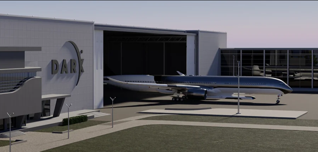
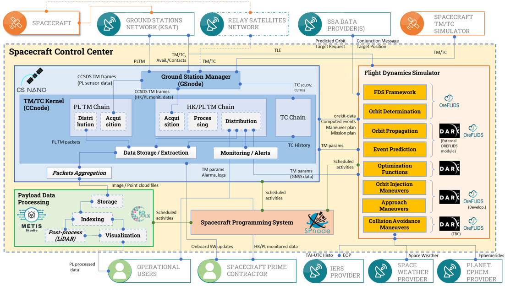

> __Customer__\: DARK (DARK)

> __Programme__\: Hadès

> __Supply Chain__\: DARK >  CS Group SPACE

# Context

DARK, CS Group France

CS Group responsabilities for Hadès Ground Segment Definition are as follows:
* Definition of ground segment software architecture for Hadès mission based on our GOSMIC product line (CSNano, OREFLIDS, METIS Core).

The features are as follows:
* Stations management 
* TC sending, TM/TMI reception
* Space dynamics, Maneuvers computation
* Integration of DARK simulator (Maneuvers computation)
* Control center programming system
* Etc.

# Project implementation

The project objectives are as follows:
* CS provides consultancy support to DARK by defining the architecture of its future ground segment to operate the Hadès mission, a demonstration mission of its in-orbit rendez-vous spacecraft.
* The architecture is mostly based on GOSMIC product line, and will reinforce GOSMIC operational experience.

The processes for carrying out the project are:
* Agile, Software Architecture

# Technical characteristics

The solution key points are as follows:
* Micro-service architecture
* Kubernetes
* METIS
* API REST

The main technologies used in this project are:

{:class="table table-bordered table-dark"}
| Domain | Technology(ies) |
|--------|----------------|
|Hardware environment(s)|PC x64|
|Operating System(s)|Windows|

{::comment}Abbreviations{:/comment}

*[CLI]: Command Line Interface
*[IaC]: Infrastructure as Code
*[PaaS]: Platform as a Service
*[VM]: Virtual Machine
*[OS]: Operating System
*[IAM]: Identity and Access Management
*[SIEM]: Security Information and Event Management
*[SSO]: Single Sign On
*[IDS]: intrusion detection
*[IPS]: intrusion prevention
*[NSM]: network security monitoring
*[DRMAA]: Distributed Resource Management Application API is a high-level Open Grid Forum API specification for the submission and control of jobs to a Distributed Resource Management (DRM) system, such as a Cluster or Grid computing infrastructure.
