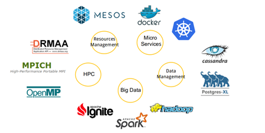

> __Customer__\: European Space Agency (ESA)

> __Programme__\: Generic

> __Supply Chain__\: ESA >  CS Group SPACE

# Context

CS Group responsabilities for Big Data from Space – Reference Architecture Framework are as follows:
* Design, Development, Integration and Maintenance,
* Open source Promoter.

The features are as follows:
* Providing CaaS provider-agnostic to automatically create and manage ICT easily deploy micro-services.
* Defining interoperable service and data management interfaces within a multi-cloud orchestration system.

# Project implementation

The project objectives are as follows:
* Creating a reliable and scalable multi-cloud computing infrastructure and data management platform relevant for Earth data processing

The processes for carrying out the project are:
* Agile, Continuous integration

# Technical characteristics

The solution key points are as follows:
* On-demand computing platform creation service.
* Useful service deployments without the complexity of managing a processing platform over a cloud infrastructure (WPS Service).

The main technologies used in this project are:

{:class="table table-bordered table-dark"}
| Domain | Technology(ies) |
|--------|----------------|
|Hardware environment(s)|Cloud - HPC|
|Operating System(s)|Linux|
|Programming language(s)|GO - Python|
|Interoperability (protocols, format, APIs)|Big Data, Protocols WPS|
|Production software (IDE, DEVOPS etc.)|Gitlab, Apache Spark, SafeScale, Docker, go test for Go - unittest for Python, Docker - Apache Ignite, Stack ELK|
|Main COTS library(ies)|S2P - QTIS|

{::comment}Abbreviations{:/comment}

*[CLI]: Command Line Interface
*[IaC]: Infrastructure as Code
*[PaaS]: Platform as a Service
*[VM]: Virtual Machine
*[OS]: Operating System
*[IAM]: Identity and Access Management
*[SIEM]: Security Information and Event Management
*[SSO]: Single Sign On
*[IDS]: intrusion detection
*[IPS]: intrusion prevention
*[NSM]: network security monitoring
*[DRMAA]: Distributed Resource Management Application API is a high-level Open Grid Forum API specification for the submission and control of jobs to a Distributed Resource Management (DRM) system, such as a Cluster or Grid computing infrastructure.
