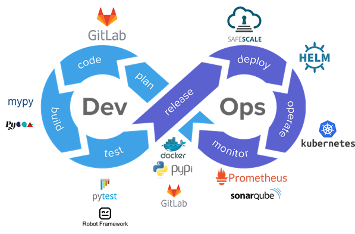

> __Customer__\: European Space Agency (ESA)

> __Programme__\: Copernicus

> __Supply Chain__\: ESA > CS GROUP >  CS Group SPACE

# Context

Data processors were not originally designed to fully benefit from cloud-based environments, so they are neither optimized to take full advantage of cloud capabilities such as elasticity of computing resources, or adapted to cloud specificities such as object storage or pay-per-use. They have been designed specifically for a systematic production context therefore they do not have the necessary adaptability to be used in more flexible, on-demand, production contexts and even less the necessary usability/ergonomic to be handled by external users. For this reason, the new processors will have to be designed to simplify the parallelization of processing and to make possible to running on smallest possible chunk of data.
The objectives are therefore:
* Define and develop a unified and coherent framework to homogenize architecture, code documentation… of data processors.
* Define and implement a modern development environment and clear guidelines, in the spirit of DevOps, which advocates automation throughout the development cycle. 
* Rethink the architecture of processors so that they can adapt to a wider range of usage, take better advantage of cloud environments, and deliver a better user experience.
* Provide a flexible solution for the wide range of processor stakeholders: from quick prototyping by scientists to production quality development by software engineers
* Set up a website for the publication of framework and processors documentation, available scientific articles but also useful information for the user community: new versions, major bugs, events… and access to the user forum.
* Free up, as much as possible, the data processors source code for adoption by new user communities and stimulate external contributions.

CS Group responsabilities for ESA CSC Data Processors Re-engineering (DPR) are as follows:
* Prime contractor
* Engineering
* EOPF Development
* ITT organisation by Best Practices
* Maintenance of legacy L0 and L1 S2 processors

The features are as follows:
* The EOPF includes:
*     Software Development Environment (SDE)
*     Core Python modules (CPM), the common libraries for product reading/writing/filtering, concurrent reading/writing, numerical computations, logs, traces, etc.
*     Reference Web Site (RWS) as an entry point to the project
*     ITT organisation by Best Practices for the reengineering
*     Data Processors reengineering
*     Legacy and reengineered processors maintenance

# Project implementation

The project objectives are as follows:
* Develop the generic Earth Observation Processor Framework (EOPF) and the associated reengineering of the L0 L1 L2 processors to support the transition of the Copernicus ground segment (Sentinel-1, -2 and -3 Land) to a cloud environment and an improvement of the storage / recalculation strategy of the generated data.

The processes for carrying out the project are:
* Agile, Continuous integration, DevOps, DevSecOps, GitFlow, ESA Best Practices, ESA ECSS Light

# Technical characteristics

The solution key points are as follows:
* The Software Development Environment stack offers a feature-complete, pragmatic and modern DevOps tooling centered on Gitlab.
* The Core Python Modules architecture is Pangeo-like: based on 3 central open source projects Dask, Xarray and Jupyter.

The main technologies used in this project are:

{:class="table table-bordered table-dark"}
| Domain | Technology(ies) |
|--------|----------------|
|Hardware environment(s)|cloud and K8S|
|Operating System(s)|Ubuntu|
|Programming language(s)|Python,C++|
|Interoperability (protocols, format, APIs)|ZARR, JSON, Netcdf, COG|
|Production software (IDE, DEVOPS etc.)|Gitlab,CodeServer, SonarQube, Kaniko, Jupyter, Kubernetes, KeyCloack, EODAG|
|Main COTS library(ies)|Python, Dask, Xarray, NumPy, GraalVM, MyPY, Pytest, Pip, code-server, JupyterLab|

{::comment}Abbreviations{:/comment}

*[CLI]: Command Line Interface
*[IaC]: Infrastructure as Code
*[PaaS]: Platform as a Service
*[VM]: Virtual Machine
*[OS]: Operating System
*[IAM]: Identity and Access Management
*[SIEM]: Security Information and Event Management
*[SSO]: Single Sign On
*[IDS]: intrusion detection
*[IPS]: intrusion prevention
*[NSM]: network security monitoring
*[DRMAA]: Distributed Resource Management Application API is a high-level Open Grid Forum API specification for the submission and control of jobs to a Distributed Resource Management (DRM) system, such as a Cluster or Grid computing infrastructure.
