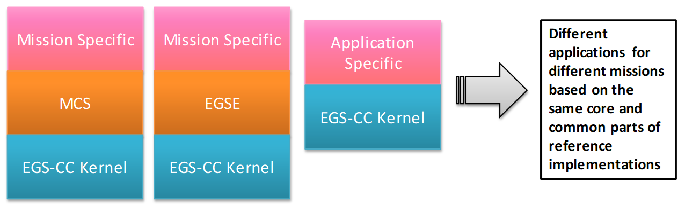

> __Customer__\: European Space Agency (ESA)

> __Programme__\: Generic

> __Supply Chain__\: ESA >  CS Group SPACE

# Context

Team: 3 FTE (6 persons)

CS Group responsabilities for European Ground System – Common Core – Software Development Environment are as follows:
* Development, Maintenance

The features are as follows:
* CS GROUP was in charge of defining and integrating a complete SDE supporting the expected functions (figure p.2).
* Moreover, CS GROUP was in charge of defining all tools, relevant procedures, configurations, scripts, exchange formats, user guide and other artefacts needed to implement the complete workflow implementing the software lifecycle workflow meeting the EGS-CC requirements.
* Furthermore, the SDE was designed to be easily deployable by all the parties involved in the EGS-CC initiative and allow fluid and frequent exchange of software, documentation and ancillary information.

# Project implementation

The project objectives are as follows:
* ESA needed a comprehensive SDE (Software Development Environment) that can be used for the development, integration, validation and maintenance of the EGS-CC software and production of the associated documentation.
* This SDE was intended to be shared with the Phase C/D industrial consortium and the other EGS-CC integrators.

The processes for carrying out the project are:
* Proof of Concept, analysis and selection of technologies potentially applicable to the EGS-CC system.

# Technical characteristics

The solution key points are as follows:
* Very good knowledge of the overall EGS-CC development requirements and lifecycle.
* Thorough hands-on experience with all tools of the EGS-CC SDE

The main technologies used in this project are:

{:class="table table-bordered table-dark"}
| Domain | Technology(ies) |
|--------|----------------|
|Operating System(s)|Linux|
|Programming language(s)|Open-source technologies|
|Production software (IDE, DEVOPS etc.)|Maven, Eclipse, Jenkins, SonarQube, Git, Confluence, JIRA, DOORS, MagicDraw|

{::comment}Abbreviations{:/comment}

*[CLI]: Command Line Interface
*[IaC]: Infrastructure as Code
*[PaaS]: Platform as a Service
*[VM]: Virtual Machine
*[OS]: Operating System
*[IAM]: Identity and Access Management
*[SIEM]: Security Information and Event Management
*[SSO]: Single Sign On
*[IDS]: intrusion detection
*[IPS]: intrusion prevention
*[NSM]: network security monitoring
*[DRMAA]: Distributed Resource Management Application API is a high-level Open Grid Forum API specification for the submission and control of jobs to a Distributed Resource Management (DRM) system, such as a Cluster or Grid computing infrastructure.
