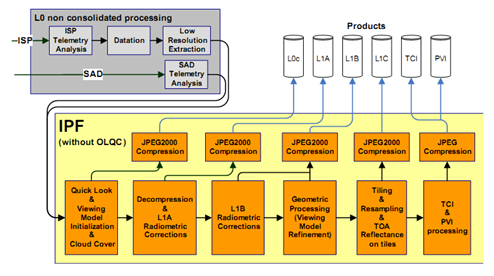

> __Customer__\: European Space Agency (ESA)

> __Programme__\: Copernicus

> __Supply Chain__\: ESA >  CS Group SPACE

# Context

CS Group responsabilities for Sentinel-2 Instrument Processing Facility are as follows:
* Maintenance of all the IPF components related to radiometric corrections, orthorectification, resampling and JPEG2000 compression. CS supervises a subcontractor (Exprivia) for some L0 components.

The features are as follows:
* **L0 & L1 Sentinel-2 Processors, including:**
*     IDP-SCs: IPF components for Radiometric / Geometric corrections and orthorectification; JPEG2000 compression; Metadata reading and updating
*     OLQC: OnLine Quality Control of generated products

# Project implementation

The project objectives are as follows:
* Development and Maintenance of the L0 and L1 operational processors integrated in the Sentinel-2 ground segment (S2A & S2B PS).

The processes for carrying out the project are:
* V Cycle, Ticketing workflow for evolving maintenance

# Technical characteristics

The solution key points are as follows:
* The image processing and image quality components are subject to **strong requirements for quality and time performances** to be reached in a single core execution. Optimization and validation tasks are key points for project success in particular for radiometric (deconvolution and denoising) and geometric corrections (resampling, refining).

The main technologies used in this project are:

{:class="table table-bordered table-dark"}
| Domain | Technology(ies) |
|--------|----------------|
|Production software (IDE, DEVOPS etc.)|OTB: (Orfeo ToolBox) used as a framework of development for the IDP-SC implementation
S2GEO: based on Rugged
GDAL: for reading images
OGR: for vectors computing
Kakadu: for JPEG 2000 image compression (IPF CFI).
The OLQC is based on Amalfi (IPF CFI).|

{::comment}Abbreviations{:/comment}

*[CLI]: Command Line Interface
*[IaC]: Infrastructure as Code
*[PaaS]: Platform as a Service
*[VM]: Virtual Machine
*[OS]: Operating System
*[IAM]: Identity and Access Management
*[SIEM]: Security Information and Event Management
*[SSO]: Single Sign On
*[IDS]: intrusion detection
*[IPS]: intrusion prevention
*[NSM]: network security monitoring
*[DRMAA]: Distributed Resource Management Application API is a high-level Open Grid Forum API specification for the submission and control of jobs to a Distributed Resource Management (DRM) system, such as a Cluster or Grid computing infrastructure.
