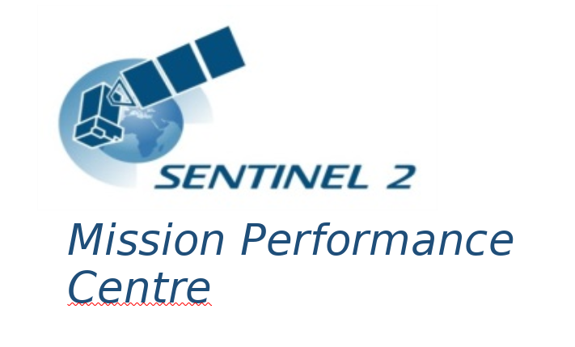

> __Customer__\: European Space Agency (ESA)

> __Programme__\: Copernicus

> __Supply Chain__\: ESA >  CS Group SPACE

# Context

CS Group responsabilities for Sentinel-2 Mission Performance Center are as follows:
* Service management,
* ESL (Expert Support Laboratories) Coordination,
* ESL L1 Radiometry Lead,
* L1 Processor Prototyping (S2 IPF),
* L2A Processor Packaging (Sen2Cor),
* Tools Maintenance (QCC).

The features are as follows:
* Calibration – update on-board and on-ground configuration data to meet product quality requirements
* Validation – assess the quality of generated data products 
* Quality Control – routinely monitor sensor status and check if derived products meet quality requirements along mission lifetime
* Data processors evolutions definition
* L2A Processor&Tools corrective and perfective maintenance – manage updates of Sen2Cor,quality control tools,calibration tools and auxiliary files
* End-to-end system performance monitoring – monitor performance of Sentinel-2 system operations(including the instrument)and assess the system

# Project implementation

The project objectives are as follows:
* Sentinel-2 Image Quality Control & Calibration & Validation
* Sentinel-2 Mission Performance Control

The processes for carrying out the project are:
* Ticketing Workflow

# Technical characteristics

The solution key points are as follows:
* CS prime for the Consortium (ACRI-ST, ARGANS, DEIMOS, AIRBUS DS, IGN, TAS, ONERA, TPZ F, DLR, TPZ G)

The main technologies used in this project are:

{:class="table table-bordered table-dark"}
| Domain | Technology(ies) |
|--------|----------------|
|Hardware environment(s)|Linux 64 bits|
|Operating System(s)|Red Hat 6.3|
|Programming language(s)|C++, Python, Java, Qt|
|Production software (IDE, DEVOPS etc.)|OXYGEN, PYLINT, PYMETRICS, RPM; Data viewer, XML editor, specific chains for S2|
|Main COTS library(ies)|QGIS, OREKIT|

{::comment}Abbreviations{:/comment}

*[CLI]: Command Line Interface
*[IaC]: Infrastructure as Code
*[PaaS]: Platform as a Service
*[VM]: Virtual Machine
*[OS]: Operating System
*[IAM]: Identity and Access Management
*[SIEM]: Security Information and Event Management
*[SSO]: Single Sign On
*[IDS]: intrusion detection
*[IPS]: intrusion prevention
*[NSM]: network security monitoring
*[DRMAA]: Distributed Resource Management Application API is a high-level Open Grid Forum API specification for the submission and control of jobs to a Distributed Resource Management (DRM) system, such as a Cluster or Grid computing infrastructure.
