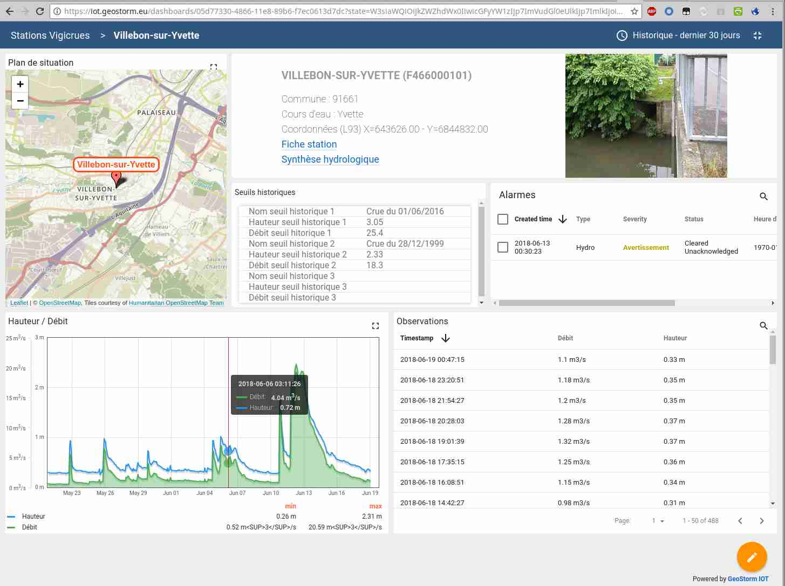
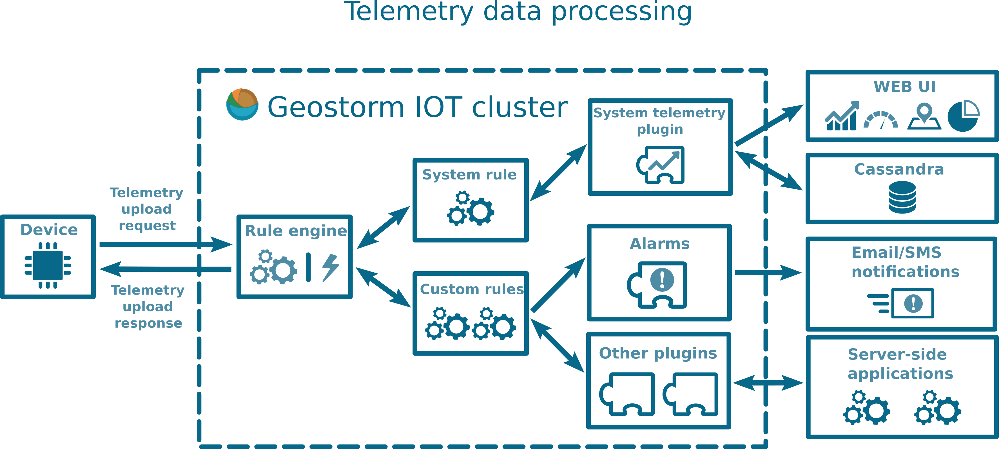

> __Customer__\: Métropole de Nîmes Direction de l'Eau (MÉTROPOLE DE NÎMES)

> __Programme__\: Risk Management

> __Supply Chain__\: MÉTROPOLE DE NÎMES >  CS Group SPACE

# Context

Pour assurer les missions de suivi, en particulier en période de crues, Nîmes Métropole devait disposer des données de suivi en temps réel du niveau de remplissage de ces barrages écrêteurs de crue

CS Group responsabilities for SERVICE WEB TEMPS REEL DE CONSULATION DES DONNEES DE HAUTEUR D’EAU DES BARRAGES ECRÊTEURS DE CRUE DE NÎMES are as follows:
* Requirement definition
* System Specification, development, testing, deployment
* Operational maintenance

The features are as follows:
* Configurable Dashboard and integrated to the portal
* Event management: alarms are raised as some criteria are exceeded (thresholds, etc.). 
* Notification:  alarms emission (mail, sms, voice call) to operators with cascade process.
* Configurable dashboards and portal integration
* Ergonomy: the HMI is intuitive and can be used by non-computer specialists.
* API for IOT data ingestion and consultation
* Maintainability: the solution is configurable and extensible.

# Project implementation

The project objectives are as follows:
* Supervision is in place in most businesses and communities, regardless of their size. 
* It verifies the proper functioning of the systems or activities of a computer system.
* The IoTSTORM platform is designed to manage the huge quantities of data produced by the IIOT.

The processes for carrying out the project are:
* V-cycle
* Continuous integration

# Technical characteristics

The solution key points are as follows:
* Service-Oriented Architecture (SOA)
* Programming by Actor (Akka framework) favouring the developemnt of competitive, scalable and robust applications.
* Several databases are supported, including Cassandra for its performance and time series management.

The main technologies used in this project are:

{:class="table table-bordered table-dark"}
| Domain | Technology(ies) |
|--------|----------------|
|Hardware environment(s)|PC|
|Operating System(s)|linux|
|Programming language(s)|Java, Javascript|
|Interoperability (protocols, format, APIs)|OPC-UA|
|Main COTS library(ies)|Spring, Cassandra, RabbitMQ, Kafka, Angular, Material Design, Akka framework|

{::comment}Abbreviations{:/comment}

*[CLI]: Command Line Interface
*[IaC]: Infrastructure as Code
*[PaaS]: Platform as a Service
*[VM]: Virtual Machine
*[OS]: Operating System
*[IAM]: Identity and Access Management
*[SIEM]: Security Information and Event Management
*[SSO]: Single Sign On
*[IDS]: intrusion detection
*[IPS]: intrusion prevention
*[NSM]: network security monitoring
*[DRMAA]: Distributed Resource Management Application API is a high-level Open Grid Forum API specification for the submission and control of jobs to a Distributed Resource Management (DRM) system, such as a Cluster or Grid computing infrastructure.
