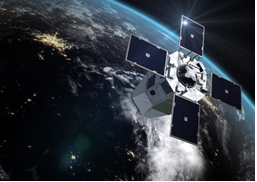

> __Customer__\: Centre National d'Etudes Spatiales (CNES)

> __Programme__\: CSO

> __Supply Chain__\: CNES >  CS Group SPACE

# Context

CS Group responsabilities for CPCC IVV and developments, support in Technical and Operational Qualification and LEOP of CSO mission are as follows:
* * IVV and developments: CS GROUP prime contractor (10 engineers), TQ/OQ tests piloted by CNES

The features are as follows:
* **AIV**: development of operational procedures, definition of plans and automated execution of tests
	**Specification and Development of components** DAC (archiving), RESA (reservation of SOL stations), GLV LV management, encryptor management, DESKTOP
	**Interface engineering**
	**Quality Support** of developments and AIV (Qualification Files)
	**QT/OQ System Tests**: preparation and support for the execution of tests
	**Operations Support**: GROUND and MISSION tours and on-call duties
	**Technical support** for FDS, MAP teams

# Project implementation

The project objectives are as follows:
* Support for the qualification of the CPCC CSO for the launches of the RECO1 (2018) and IDENT (2020) satellites

The processes for carrying out the project are:
* Requirements management (STB, IF): Testlink and Excel
* Specific process of Assembly, Integration, Validation Qualification of Ground Control Segments
* Ground control segment qualification system tests: Compatibility, Technical and Operational Qualification

# Technical characteristics

The solution key points are as follows:
* Successful implementation of a first functional alternative solution in less than 6 months based on OpenCenter
* Very tense schedule, testing for the teams
* Strong responsiveness of the development team
* Deployment of a multisat solution on an operational single-sat center
* Complex mission: chronology of bi-satellite activities, satellite carrying the COA

The main technologies used in this project are:

{:class="table table-bordered table-dark"}
| Domain | Technology(ies) |
|--------|----------------|
|Hardware environment(s)|Esx Dell, SAN, Appliance Netbackup, HP Thin Pro, switch, firewall, BPD, Crypsis|
|Operating System(s)|Red Hat 6.5 & 7.2, VMWare, NoMachine,  PXE|
|Programming language(s)|Java,C++, Python, Bash, Javascript, PHP|
|Interoperability (protocols, format, APIs)|XML, CCSDS|
|Production software (IDE, DEVOPS etc.)|Testlink, Git, Ansible, Gradle autotools rpmbuild|
|Main COTS library(ies)|Ldap, Tkinter, SWT|

{::comment}Abbreviations{:/comment}

*[CLI]: Command Line Interface
*[IaC]: Infrastructure as Code
*[PaaS]: Platform as a Service
*[VM]: Virtual Machine
*[OS]: Operating System
*[IAM]: Identity and Access Management
*[SIEM]: Security Information and Event Management
*[SSO]: Single Sign On
*[IDS]: intrusion detection
*[IPS]: intrusion prevention
*[NSM]: network security monitoring
*[DRMAA]: Distributed Resource Management Application API is a high-level Open Grid Forum API specification for the submission and control of jobs to a Distributed Resource Management (DRM) system, such as a Cluster or Grid computing infrastructure.
