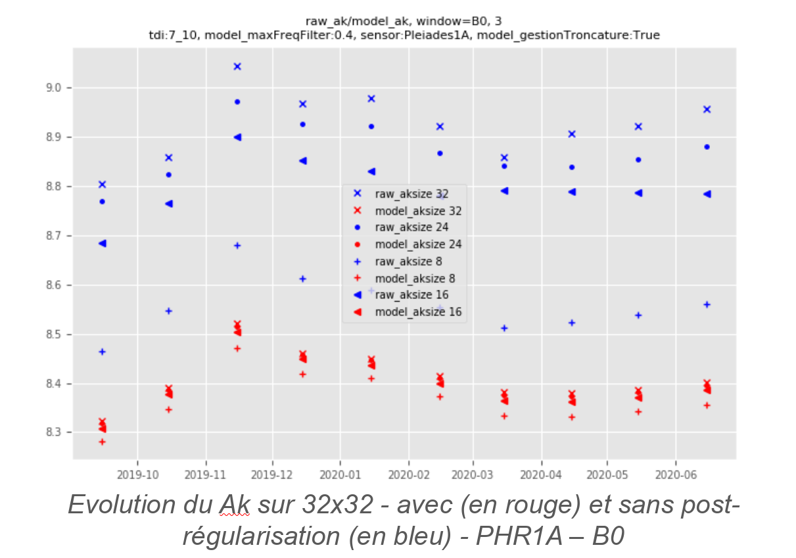

> __Customer__\: Centre National d'Etudes Spatiales (CNES)

> __Programme__\: DTQTIS

> __Supply Chain__\: CNES >  CS Group SPACE

# Context

CS Group responsabilities for Studies for absolute calibration and MTF measurement of PLEIADES sensors (Star & MOON Methods) are as follows:
* Study, treatments, development

The features are as follows:
* **PHR1A & PHR1B Star Calibration:**
* Generation of Starpools using the ICC Isatis procedure
* Adding new Starpools to previously used data
* Analysis of new input data: time series trace of the digital count of each star for the Pléiades 1A and 1B Starpools and for different extraction window sizes
* Estimation of absolute and FTM calibration coefficients
	**LUNE PNEO3&PNEO4 calibration:**
* Carrying out pre-treatments and calibration treatments for PNEO3&PNEO4
* Evolution of calibration and synthesis tools to refine the analysis of results

# Project implementation

The project objectives are as follows:
* Estimated absolute calibration and MTF for Pléiades 1A and 1B (Star Method)
* Calculation & analysis of the absolute calibration coefficients of PNEO3 & PNEO4 (LUNE Method)

The processes for carrying out the project are:
* Study, regular progress meetings

# Technical characteristics

The solution key points are as follows:
* Not applicable

The main technologies used in this project are:

{:class="table table-bordered table-dark"}
| Domain | Technology(ies) |
|--------|----------------|
|Programming language(s)|Python|
|Production software (IDE, DEVOPS etc.)|ICC Pléiades|

{::comment}Abbreviations{:/comment}

*[CLI]: Command Line Interface
*[IaC]: Infrastructure as Code
*[PaaS]: Platform as a Service
*[VM]: Virtual Machine
*[OS]: Operating System
*[IAM]: Identity and Access Management
*[SIEM]: Security Information and Event Management
*[SSO]: Single Sign On
*[IDS]: intrusion detection
*[IPS]: intrusion prevention
*[NSM]: network security monitoring
*[DRMAA]: Distributed Resource Management Application API is a high-level Open Grid Forum API specification for the submission and control of jobs to a Distributed Resource Management (DRM) system, such as a Cluster or Grid computing infrastructure.
