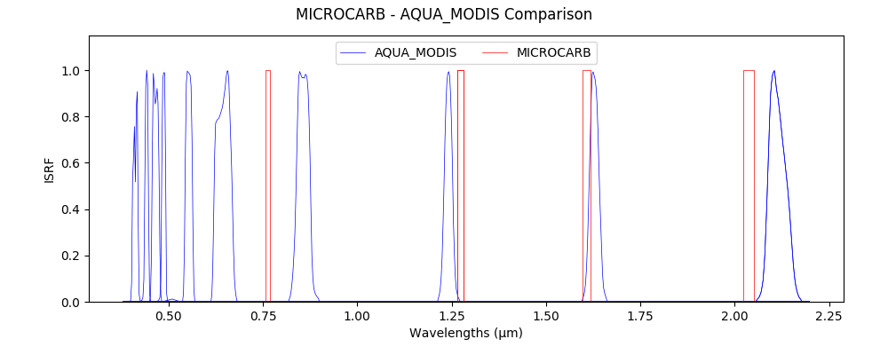

> __Customer__\: Centre National d'Etudes Spatiales (CNES)

> __Programme__\: MicroCarb

> __Supply Chain__\: CNES >  CS Group SPACE

# Context

CS Group responsabilities for MicroCarb radiometric calibration on natural targets are as follows:
* Study, development

The features are as follows:
* **Glitter Calibration :**
*     Feasibility study
*     Selecting valid channels
*     Specification and development of an algorithm for calculating gas transmission from LUT 4AOP
*     Prototyping and evaluation of the calibration algorithm (MUSCLE-NEO adaptation in progress)
	**Desert Calibration :**
*     Selection of sensors and reference bands
*     Selection of 4 calibration sites
*     Implementation of a gas transmission correction method using LUT 4AOP
*     Prototyping and evaluation of the calibration algorithm (MUSCLE-NEO adaptation in progress)

# Project implementation

The project objectives are as follows:
* Implementation of radiometric calibration methods on natural targets (Deserts, Glitter) for MicroCarb

The processes for carrying out the project are:
* Studies, Simulations, Prototyping, Regular progress updates, Reports

# Technical characteristics

The solution key points are as follows:
* Not applicable

The main technologies used in this project are:

{:class="table table-bordered table-dark"}
| Domain | Technology(ies) |
|--------|----------------|
|Programming language(s)|Python, IDL, KSH, QSUB|
|Main COTS library(ies)|MUSCLE, MUSCLE-NEO, 4AOP, SOS-ABS, SMAC|

{::comment}Abbreviations{:/comment}

*[CLI]: Command Line Interface
*[IaC]: Infrastructure as Code
*[PaaS]: Platform as a Service
*[VM]: Virtual Machine
*[OS]: Operating System
*[IAM]: Identity and Access Management
*[SIEM]: Security Information and Event Management
*[SSO]: Single Sign On
*[IDS]: intrusion detection
*[IPS]: intrusion prevention
*[NSM]: network security monitoring
*[DRMAA]: Distributed Resource Management Application API is a high-level Open Grid Forum API specification for the submission and control of jobs to a Distributed Resource Management (DRM) system, such as a Cluster or Grid computing infrastructure.
