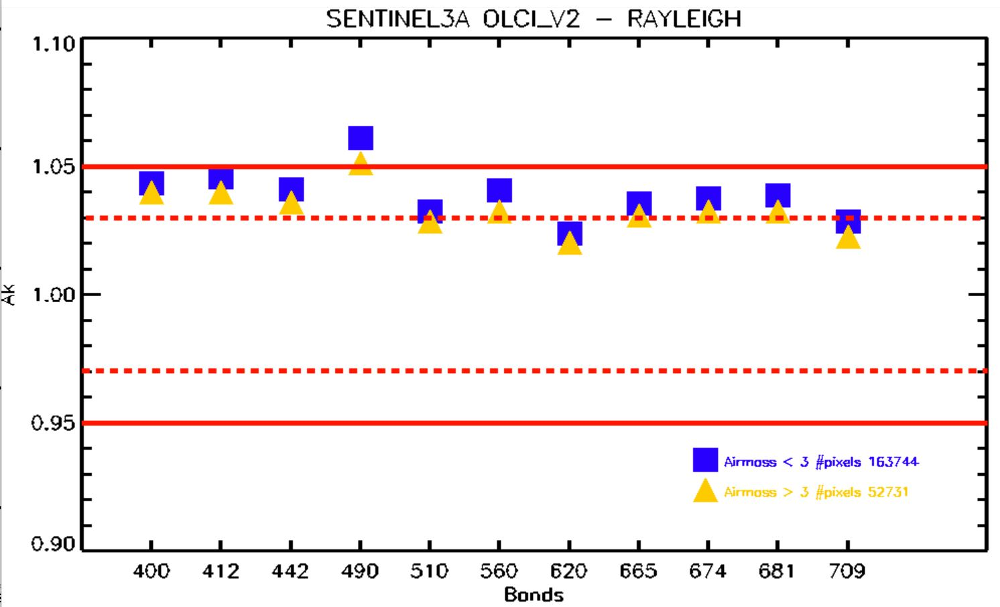

> __Customer__\: Centre National d'Etudes Spatiales (CNES)

> __Programme__\: DTQTIS

> __Supply Chain__\: CNES >  CS Group SPACE

# Context

CS Group responsabilities for Studies for the calibration of OLCI and SLSTR / Sentinel-3 sensors are as follows:
* Study, development

The features are as follows:
* Realization / Analysis of OLCI and SLSTR calibrations
* Evaluation of the impact of air mass on Rayleigh OLCI calibration
* Study of calibration defects of the S6 SLSTR band (Deserts & Glitter Method)
* S3 extraction on instrumented sites (La Crau / Gobabeb)
* Other miscellaneous studies (Gas transmissions, marine BRDF correction, Climzoo interpolation, etc.)

# Project implementation

The project objectives are as follows:
* Provide support for the calibration of OLCI and SLSTR sensors on board Sentinel-3A and 3B

The processes for carrying out the project are:
* Studies, Regular progress updates, Reports

# Technical characteristics

The solution key points are as follows:
* Not applicable

The main technologies used in this project are:

{:class="table table-bordered table-dark"}
| Domain | Technology(ies) |
|--------|----------------|
|Programming language(s)|Python, IDL, KSH|
|Main COTS library(ies)|MUSCLE, SOS-ABS, SMAC, 4AOP|

{::comment}Abbreviations{:/comment}

*[CLI]: Command Line Interface
*[IaC]: Infrastructure as Code
*[PaaS]: Platform as a Service
*[VM]: Virtual Machine
*[OS]: Operating System
*[IAM]: Identity and Access Management
*[SIEM]: Security Information and Event Management
*[SSO]: Single Sign On
*[IDS]: intrusion detection
*[IPS]: intrusion prevention
*[NSM]: network security monitoring
*[DRMAA]: Distributed Resource Management Application API is a high-level Open Grid Forum API specification for the submission and control of jobs to a Distributed Resource Management (DRM) system, such as a Cluster or Grid computing infrastructure.
