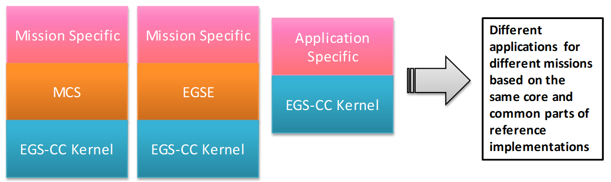
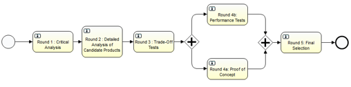

> __Customer__\: European Space Agency (ESA)

> __Programme__\: Generic

> __Supply Chain__\: ESA >  CS Group SPACE

# Context

Firm fixed price contract
CS Effort: 34 man-months
Team:
CS: 5 persons
Rhea: 3 persons
Siemens: 3 persons
Novabase: 1 person

CS Group responsabilities for European Ground System – Common Core – Proof of Concept are as follows:
* Consortium leader (CS Group, Rhea, Siemens, Novabase)
* Development, Maintenance

The features are as follows:
* Detailed technologies analysis based on criteria defined in order to meet the relevant EGS-CC requirements.
* Trade-off tests to ensure the best overall assemble of technologies working together.
* PoC implementation and performance tests to ensure that the selected technologies are compliant with the EGS-CC requirements, mainly in the area of performance requirements and key functional requirements which depend on technologies and third party products

# Project implementation

The project objectives are as follows:
* The European Ground Systems – Common Core (EGS-CC) is a European initiative to develop a common infrastructure to support space systems monitoring and control in pre- and post-launch phases for all types of missions.
* The EGS-CC POC project is responsible for the analysis and selection of technologies potentially applicable to the EGS-CC system.

The processes for carrying out the project are:
* Proof of Concept, analysis and selection of technologies potentially applicable to the EGS-CC system.

# Technical characteristics

The solution key points are as follows:
* The EGS-CC has adopted for the technology selection process a set of criteria based on the FURPS+ model developed by Hewlett Packard and extending it with EGS-CC specific. This set of criteria has been refined at the start of the project, and applied throughout the work as part of the different activities performed.
* Key aspects of the EGS-CC prototyped.

The main technologies used in this project are:

{:class="table table-bordered table-dark"}
| Domain | Technology(ies) |
|--------|----------------|
|Operating System(s)|Linux|
|Programming language(s)|Java, open-source technologies|

{::comment}Abbreviations{:/comment}

*[CLI]: Command Line Interface
*[IaC]: Infrastructure as Code
*[PaaS]: Platform as a Service
*[VM]: Virtual Machine
*[OS]: Operating System
*[IAM]: Identity and Access Management
*[SIEM]: Security Information and Event Management
*[SSO]: Single Sign On
*[IDS]: intrusion detection
*[IPS]: intrusion prevention
*[NSM]: network security monitoring
*[DRMAA]: Distributed Resource Management Application API is a high-level Open Grid Forum API specification for the submission and control of jobs to a Distributed Resource Management (DRM) system, such as a Cluster or Grid computing infrastructure.
