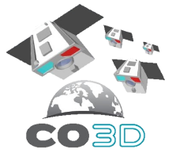
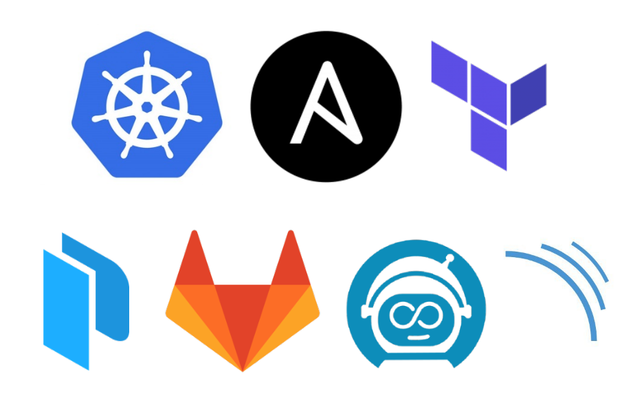

> __Customer__\: Centre National d'Etudes Spatiales (CNES)

> __Programme__\: CO3D

> __Supply Chain__\: CNES >  CS Group SPACE

# Context

CS Group responsabilities for Constellation Optical 3D CO3D Instrument Calibration Center are as follows:
* Design, Development, Integration and Maintenance,

The features are as follows:
* Image calibration center for CO3D

# Project implementation

The project objectives are as follows:
* Development and provision of the ICC (Instrument Calibration Center) platform
* Combined application of the agile Scrum method and the DevOps approach

The processes for carrying out the project are:
* Agile Scrum method
* DevOps approach
* Continuous cloud deployment

# Technical characteristics

The solution key points are as follows:
* Infrastructure as Code: fully scripted and automated deployment of infrastructure and services
* Elastic platform (based on Kubernetes clusters and S3 storage) to meet instant processing needs, optimizing cost
* Providing a virtual desktop and complete work environment accessible from the browser

The main technologies used in this project are:

{:class="table table-bordered table-dark"}
| Domain | Technology(ies) |
|--------|----------------|
|Hardware environment(s)|Cloud (Flexible Engine)|
|Operating System(s)|GNU/Linux|
|Programming language(s)|GO, Python, YAML, Helmfile|
|Interoperability (protocols, format, APIs)|S3, API REST, gRPC, JSON|
|Production software (IDE, DEVOPS etc.)|Gitlab, Gitlab CI, SonarQube, Artifactory, Docker, Kubernetes, Terraform, Ansible, Stack ELK, HashiCorp Vault, Vaultwarden, Stash, JupyterHub, Virtual Research Environment, PostgreSQL, SQLite, Camunda, Keycloak, Code Server, Apisix, MediaWiki, Nexusz, OpenLDAP, Grafana, Multisat Data Store (MDS)|
|Main COTS library(ies)|CARS, GDAL, Taskflow, ALCIDE, MARIO, VueJS, Python-Flask, boto3|

{::comment}Abbreviations{:/comment}

*[CLI]: Command Line Interface
*[IaC]: Infrastructure as Code
*[PaaS]: Platform as a Service
*[VM]: Virtual Machine
*[OS]: Operating System
*[IAM]: Identity and Access Management
*[SIEM]: Security Information and Event Management
*[SSO]: Single Sign On
*[IDS]: intrusion detection
*[IPS]: intrusion prevention
*[NSM]: network security monitoring
*[DRMAA]: Distributed Resource Management Application API is a high-level Open Grid Forum API specification for the submission and control of jobs to a Distributed Resource Management (DRM) system, such as a Cluster or Grid computing infrastructure.
