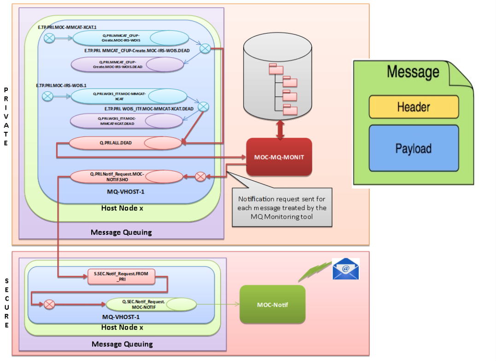

> __Customer__\: Airbus Defense & Space Geo (ADS-GEO)

> __Programme__\: Geo Digital System

> __Supply Chain__\: ADS-GEO >  CS Group SPACE

# Context

CS Group responsabilities for Common service involved in the Geo Digital System (GDS) of Airbus DS Geo are as follows:
* MCO corrective, MCO, Reversibility

The features are as follows:
* Configure connection to RabbitMQ (dead-letter queue, exchange of notification ..etc..), parameter of monitoring tool in properties files
* Communicate in TLS or not with RabbitMQ
* Get property headers of dead-letter message
* If enable the creating of tree in order to display the message : create a tree, create file displaying headers of message, create file displaying payload of message
* If enable the creating of message to send in a exchange of notification : create xml file, compress xml file to tar.gz, send message with tar.gz in payload to exchange of Notification.

# Project implementation

The project objectives are as follows:
* **Monitoring tool is used to visualize all dead-letter messages which are published in one or several dead-letter queue(s) of only one VHOST for an instance of RabbitMQ**
* The dead-letter message contains all information of initial message (routingKey, payload, headers, etc.) with information concerning the cause of reject, in the x-death section of headers.

The processes for carrying out the project are:
* Continuous integration process

# Technical characteristics

The solution key points are as follows:
* MicroService Architecture,
* Enterprise Integration Patterns solution,  
* Structure based on container platforms (**Docker**), installation on Openshift

The main technologies used in this project are:

{:class="table table-bordered table-dark"}
| Domain | Technology(ies) |
|--------|----------------|
|Operating System(s)|Linux|
|Programming language(s)|Java, Xml, Json|
|Production software (IDE, DEVOPS etc.)|RabbitMQ, Maven, Docker, Jenkins, Git, Eclipse, Testlink|
|Main COTS library(ies)|Spring Boot, Spring Integration, Logback, Junit|

{::comment}Abbreviations{:/comment}

*[CLI]: Command Line Interface
*[IaC]: Infrastructure as Code
*[PaaS]: Platform as a Service
*[VM]: Virtual Machine
*[OS]: Operating System
*[IAM]: Identity and Access Management
*[SIEM]: Security Information and Event Management
*[SSO]: Single Sign On
*[IDS]: intrusion detection
*[IPS]: intrusion prevention
*[NSM]: network security monitoring
*[DRMAA]: Distributed Resource Management Application API is a high-level Open Grid Forum API specification for the submission and control of jobs to a Distributed Resource Management (DRM) system, such as a Cluster or Grid computing infrastructure.
