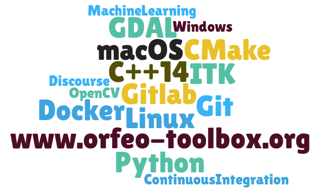

> __Customer__\: Centre National d’Études Spatiales (CNES)

> __Programme__\: Generic

> __Supply Chain__\: CNES >  CS Group SPACE

# Context

CS Group responsabilities for Orfeo Toolbox are as follows:
* Library maintenance and developments
* Community Support
* Animation of user and developer communities
* Maintenance of the platform for online services

The features are as follows:
* **Segmentation**: applicable on a large scale (mean shift, watersheds, etc.) vectorization, comparison
	**Machine Learning**: Training of classification and regression models. Application to image and vector data. Assessment
	**Extraction of primitives**: Contour detection, calculation of radiometric indices, texture extraction, calculation of global and local statistics, mathematical morphology
	**Image geometry**: Ortho-rectification, model refinement, grid resampling, PanSharpening, Disparity calculation, image registration
	**Calibration, Hyperspectral…**

# Project implementation

The project objectives are as follows:
* **OTB**: Free image processing toolbox for remote sensing, composed of a C++ library and a set of applications accessible from different Wrappers: Python 3, command line, QGIS plugin, GUI.

The processes for carrying out the project are:
* Iterative development
* Continuous development and integration (coding/unit testing)
* Automatic Test Plan Generator with test execution and insertion of results in a CDash instance

# Technical characteristics

The solution key points are as follows:
* C++ software based on OTB libraries
* Python
* CMake / CTest / CDash
* Multiple plugin handling using generic factories

The main technologies used in this project are:

{:class="table table-bordered table-dark"}
| Domain | Technology(ies) |
|--------|----------------|
|Operating System(s)|Linux, Windows|
|Programming language(s)|C++ 14, Python|
|Production software (IDE, DEVOPS etc.)|CMake, SWIG, Gitlab, Gitlab-CI, Sphinx, Discourse, Wordpress, Doxygen|
|Main COTS library(ies)|ITK, GDAL, Boost, 6S, MuParser, Shark ML|

{::comment}Abbreviations{:/comment}

*[CLI]: Command Line Interface
*[IaC]: Infrastructure as Code
*[PaaS]: Platform as a Service
*[VM]: Virtual Machine
*[OS]: Operating System
*[IAM]: Identity and Access Management
*[SIEM]: Security Information and Event Management
*[SSO]: Single Sign On
*[IDS]: intrusion detection
*[IPS]: intrusion prevention
*[NSM]: network security monitoring
*[DRMAA]: Distributed Resource Management Application API is a high-level Open Grid Forum API specification for the submission and control of jobs to a Distributed Resource Management (DRM) system, such as a Cluster or Grid computing infrastructure.
