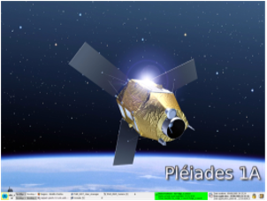

> __Customer__\: Centre National d'Etudes Spatiales (CNES)

> __Programme__\: Pléiades

> __Supply Chain__\: CNES >  CS Group SPACE

# Context

CS Group responsabilities for Pléiades ground support are as follows:
* Maintenance, Operational Support, Team of 4 engineers

The features are as follows:
* Installation and configuration of software versions ; hardware checks and inventory ; first-level failure investigation ; hardware replacement
* Support to board, mission and orbitography teams 
* Participation to coordination meetings ; technical issues management 
* Bugs fixing ; Specification improvements ; SDGC components technical follow-up 
* SDGC Software Component Installations and Configurations
* Operational procedures writing and Operations support

# Project implementation

The project objectives are as follows:
* Ground operation to maintain routine operational monitoring activities
* Technical follow-up of some components of the SDGC
* Implementation and monitoring of exceptional operations
* Preparation and implementation of tests

The processes for carrying out the project are:
* Ground support in delegation of tasks

# Technical characteristics

The solution key points are as follows:
* Multi-component and platform architecture
* Sensitive context (defense)
* Maintenance in operational conditions
* Interface with other CNES services

The main technologies used in this project are:

{:class="table table-bordered table-dark"}
| Domain | Technology(ies) |
|--------|----------------|
|Hardware environment(s)|IBM PC servers,PC|
|Operating System(s)|Redhat Linux Enterprise 5, Windows|
|Programming language(s)|C ++, scripts|
|Interoperability (protocols, format, APIs)|ntp, XML, ACL, syslogNG, kde|
|Production software (IDE, DEVOPS etc.)|Kerberos, LDAP, QT, Nagios, Apache, dns, lprNG, TiNa, auditd, Tripwire, SAN|

{::comment}Abbreviations{:/comment}

*[CLI]: Command Line Interface
*[IaC]: Infrastructure as Code
*[PaaS]: Platform as a Service
*[VM]: Virtual Machine
*[OS]: Operating System
*[IAM]: Identity and Access Management
*[SIEM]: Security Information and Event Management
*[SSO]: Single Sign On
*[IDS]: intrusion detection
*[IPS]: intrusion prevention
*[NSM]: network security monitoring
*[DRMAA]: Distributed Resource Management Application API is a high-level Open Grid Forum API specification for the submission and control of jobs to a Distributed Resource Management (DRM) system, such as a Cluster or Grid computing infrastructure.
