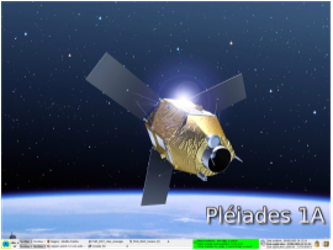

> __Customer__\: Centre National d'Etudes Spatiales (CNES)

> __Programme__\: Pléiades

> __Supply Chain__\: CNES >  CS Group SPACE

# Context

CS Group responsabilities for PLEIADES Mission Support are as follows:
* Support to CNES mission teams for the implementation of operational activities and the monitoring of PLEIADES missions

The features are as follows:
* Preparation, qualification and execution of mission operations 
* Maintaining operational documentation
* Implementation of operational scenarios for training or skills maintenance purposes
* Missionization of operating tools
* Development of new procedures
* Support for the preparation of operations in the operational qualification phase, launch, stationing, in-flight acceptance, routine

# Project implementation

The project objectives are as follows:
* Support to CNES mission teams for the implementation of operational activities and monitoring of the PLEIADES, CSO and Hélios missions

The processes for carrying out the project are:
* Technical Assistance

# Technical characteristics

The solution key points are as follows:
* Mission management tools (DUPC, EGM, CPM)
* SDGC PHR, CMP Hélios and CPCC CSO environments and tools
* Operational control center
* Complex organizational environment
* Sensitive context (national defense)   
* Mastery of technical (software) and functional elements (observation satellite mission in low orbit)
* Hotline support/4 engineers team

The main technologies used in this project are:

{:class="table table-bordered table-dark"}
| Domain | Technology(ies) |
|--------|----------------|
|Hardware environment(s)|Serveurs PC IBM, PC, Moyens du SDGC PHR, CMP HELIOS et CPCC CSO|
|Operating System(s)|Redhat Linux Enterprise 5, Windows|
|Interoperability (protocols, format, APIs)|scripts, XML|
|Main COTS library(ies)|Kerberos, LDAP, ACL|

{::comment}Abbreviations{:/comment}

*[CLI]: Command Line Interface
*[IaC]: Infrastructure as Code
*[PaaS]: Platform as a Service
*[VM]: Virtual Machine
*[OS]: Operating System
*[IAM]: Identity and Access Management
*[SIEM]: Security Information and Event Management
*[SSO]: Single Sign On
*[IDS]: intrusion detection
*[IPS]: intrusion prevention
*[NSM]: network security monitoring
*[DRMAA]: Distributed Resource Management Application API is a high-level Open Grid Forum API specification for the submission and control of jobs to a Distributed Resource Management (DRM) system, such as a Cluster or Grid computing infrastructure.
