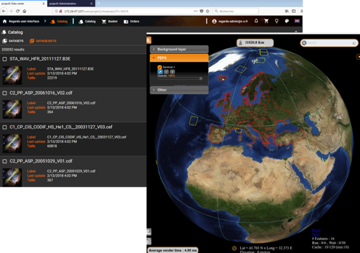

> __Customer__\: Centre National d'Etudes Spatiales (CNES)

> __Programme__\: Generic

> __Supply Chain__\: CNES >  CS Group SPACE

# Context

CS Group responsabilities for REnouvellement des outils Génériques d’Accès et d’aRchivage pour les Données Spatiales are as follows:
* Design, Development, Integration, Maintenance
* Open source promoter

The features are as follows:
* Efficient integration of data and __metadata__
* Enrichment and valorization to scientific community: standard __interoperability__ protocols, __advanced search__ interface displays
* __Sustainable__ archiving
* Advanced administration and monitoring
* __Remote processing__ via standard protocols (WPS, UWS)
* High level of __adaptability__ (framework configuration, external developers plug-in)

# Project implementation

The project objectives are as follows:
* Data Preservation and valorization
* Open source system

The processes for carrying out the project are:
* Software V-Model, Requirement engineering, Continuous Integration

# Technical characteristics

The solution key points are as follows:
* Micro-service Distributed REST Architecture based on Spring platform: Spring Boot for the micro-services implementation; Spring Cloud for micro-services infrastructure management.
* Full web architecture (light client): React; JavaScript.

The main technologies used in this project are:

{:class="table table-bordered table-dark"}
| Domain | Technology(ies) |
|--------|----------------|
|Hardware environment(s)|PC, VMWare HP|
|Operating System(s)|Linux Red Hat|
|Programming language(s)|Java, HTML, CSS, JavaScript, XSD, XML|
|Interoperability (protocols, format, APIs)|PAIS, XFDU, FITS, WPS, UWS|
|Production software (IDE, DEVOPS etc.)|Eclipse JEE, Netbeans, IntelliJ IDEA, Atom, UML-CS / Enterprise Architect, Git, Subversion, Apache Maven, NPM, Webpack, Jenkins, Travis CI, Fireworks, Junit, Selenium (tests IHM), Mockito, TestLink, Spring Test|
|Main COTS library(ies)|PostgreSQL, MongoDB, Mysql, Elasticsearch|

{::comment}Abbreviations{:/comment}

*[CLI]: Command Line Interface
*[IaC]: Infrastructure as Code
*[PaaS]: Platform as a Service
*[VM]: Virtual Machine
*[OS]: Operating System
*[IAM]: Identity and Access Management
*[SIEM]: Security Information and Event Management
*[SSO]: Single Sign On
*[IDS]: intrusion detection
*[IPS]: intrusion prevention
*[NSM]: network security monitoring
*[DRMAA]: Distributed Resource Management Application API is a high-level Open Grid Forum API specification for the submission and control of jobs to a Distributed Resource Management (DRM) system, such as a Cluster or Grid computing infrastructure.
