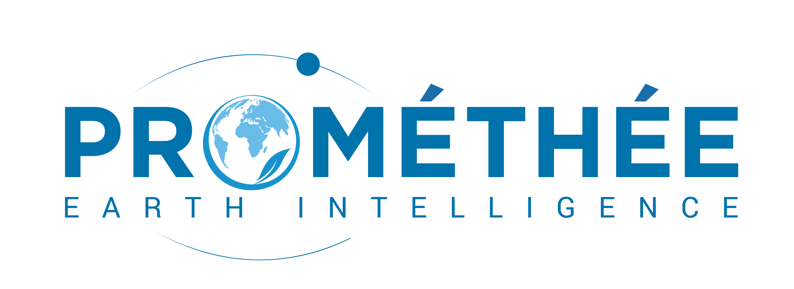
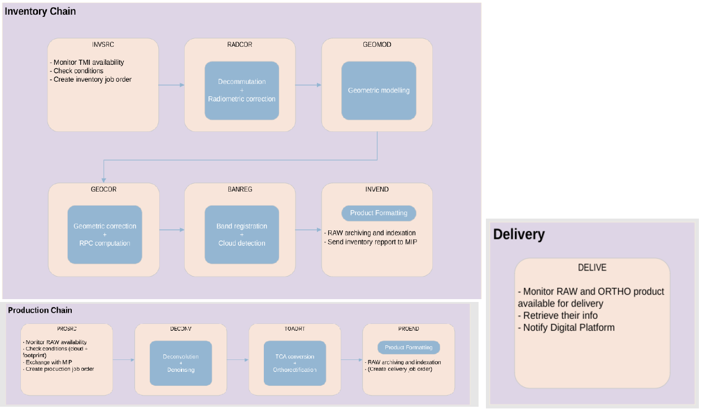

> __Customer__\: PROMETHEE

> __Programme__\: Protomethee

> __Supply Chain__\: PROMETHEE >  CS Group SPACE

# Context

The New Space startup Prométhée launched its prototype PROTOMETHEE in November 2023. The JAPETUS constellation should follow in 2025. These are THR, multispectral nano-satellites.
CS GROUP has developed the image processing chain (IPS) for PROTOMETHEE from decommutation operations to the publication of L1B (raw) and L1C (ortho) images on an online catalog.
CS GROUP has also developed the algorithms used for the in-flight calibration/validation phases and performs Cal-Val operations as well as the associated in-flight routines.

CS Group responsabilities for Development of the IPS and Cal-Val activities for Prométhée prototype -> PROTOMETHEE are as follows:
* Software Development
* Cal-Val Activities

The features are as follows:
* IPS: INVENTORY (decommutation, radio/geo corrections, band registration, cloud detection, formatting), PRODUCTION (deconvolution & denoising, TOA conversion, orthorectification, formatting), DELIVERY (push to catalog)
* METIS (CS GROUP) components
* Cal-Val: radio (PRNU, DSNU,FTM), geo (bias computation, absolute geoloc, interbands)

# Project implementation

The project objectives are as follows:
* IPS (Image Processing Service) development : image processing from decommutation to production of L1B & L1C in online catalog
* Radiometric and geometric calibration and validation activities
* In-flight routines

The processes for carrying out the project are:
* Agile

# Technical characteristics

The solution key points are as follows:
* Gitlab, Metis Core, micro-service

The main technologies used in this project are:

{:class="table table-bordered table-dark"}
| Domain | Technology(ies) |
|--------|----------------|
|Operating System(s)|Linux|
|Programming language(s)|Python, C++|
|Production software (IDE, DEVOPS etc.)|Git, Docker, Kubernetes|
|Main COTS library(ies)|OTB, Metis Core components|

{::comment}Abbreviations{:/comment}

*[CLI]: Command Line Interface
*[IaC]: Infrastructure as Code
*[PaaS]: Platform as a Service
*[VM]: Virtual Machine
*[OS]: Operating System
*[IAM]: Identity and Access Management
*[SIEM]: Security Information and Event Management
*[SSO]: Single Sign On
*[IDS]: intrusion detection
*[IPS]: intrusion prevention
*[NSM]: network security monitoring
*[DRMAA]: Distributed Resource Management Application API is a high-level Open Grid Forum API specification for the submission and control of jobs to a Distributed Resource Management (DRM) system, such as a Cluster or Grid computing infrastructure.
