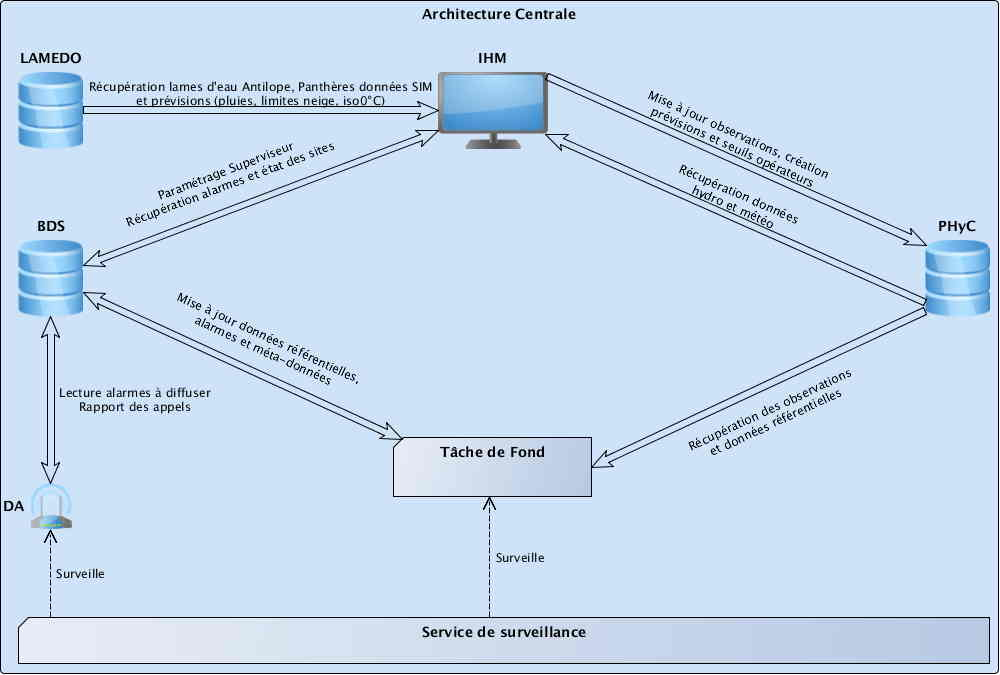

> __Customer__\: Service Central d'Hydrométéorologie et d'Appui à la Prévision des Inondations (SCHAPI)

> __Programme__\: Risk Management

> __Supply Chain__\: SCHAPI >  CS Group SPACE

# Context

CS Group responsabilities for National hydrometric data supervisor are as follows:
* System specification and design
* Development
* Deployment of the system in SCHAPI and SPCs
* Training
* Maintenance

The features are as follows:
* Customized maps display for hydrologolical situation follow up 
* Hydrologolical data visualisation with tables and graphics. Data analysis function.
* Database access through WebServices
* Alarms management and automatic call to on duty personal.
* Remote acces through Web technologies.
* Sites multi-criteria search (alert level, name, river, hydro conditions)
* Advanced management function of the desktop
* log book, events book
* Forcasts display

# Project implementation

The project objectives are as follows:
* Supervision of hydrometric and meteorological data, in cartographic, graphic and tables.
* Visualization of forecasts from models and the creation of expertise.
* Management of hydrological, technical and system alarms.

The processes for carrying out the project are:
* Incremental V Cycle

# Technical characteristics

The solution key points are as follows:
* The architecture model is Client Server (n-tier) with a thin client.
* Main components are :
	 *  Man Machine Interface (MMI)
	 *  Background tasking service 
	 *  Alarms Diffusion
	 *  Supervisor Database management
	 *  Monitoring Service

The main technologies used in this project are:

{:class="table table-bordered table-dark"}
| Domain | Technology(ies) |
|--------|----------------|
|Operating System(s)|Linux|
|Programming language(s)|Php 5.3, JAVA, C, C++, JavaScript|
|Interoperability (protocols, format, APIs)|XML|
|Production software (IDE, DEVOPS etc.)|SVN|
|Main COTS library(ies)|PostgreSQL, PostGIS, Mapserver, pMapper, Openlayer|

{::comment}Abbreviations{:/comment}

*[CLI]: Command Line Interface
*[IaC]: Infrastructure as Code
*[PaaS]: Platform as a Service
*[VM]: Virtual Machine
*[OS]: Operating System
*[IAM]: Identity and Access Management
*[SIEM]: Security Information and Event Management
*[SSO]: Single Sign On
*[IDS]: intrusion detection
*[IPS]: intrusion prevention
*[NSM]: network security monitoring
*[DRMAA]: Distributed Resource Management Application API is a high-level Open Grid Forum API specification for the submission and control of jobs to a Distributed Resource Management (DRM) system, such as a Cluster or Grid computing infrastructure.
