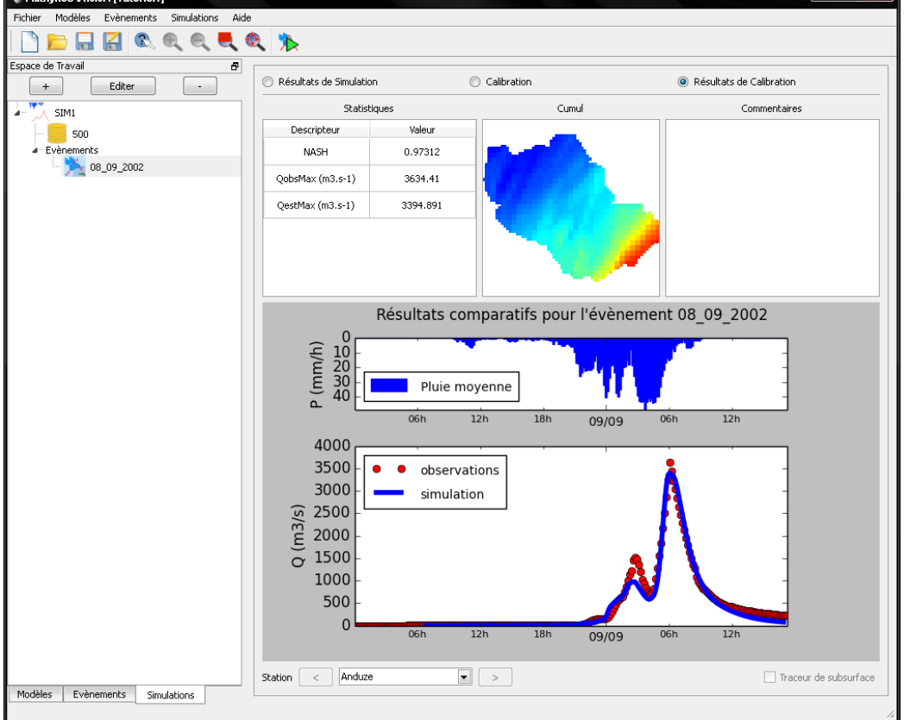
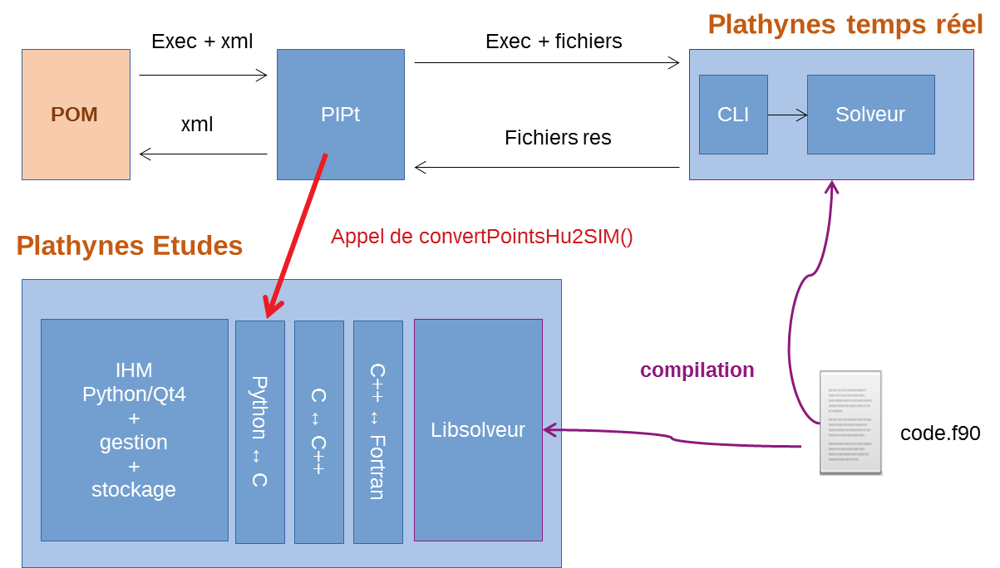

> __Customer__\: Service Central d'Hydrométéorologie et d'Appui à la Prévision des Inondations (SCHAPI)

> __Programme__\: Risk Management

> __Supply Chain__\: SCHAPI >  CS Group SPACE

# Context

The SCHAPI establishes and disseminates, in coordination with the flood forecasting services (SPC), a continuous information of vigilance for floods. It is acting in support to the 19 SPCs and carries out a mission of organization, animation, assistance, advice and training with the services and establishments in charge of flood forecasting, and more generally, hydrology and hydrometry.
It coordinates the technical and scientific aspects of flood forecasting by piloting and promoting a national initiative to provide the flood forecasting network with models and, more generally, with tools or methods providing real-time hydrological forecasts.

CS Group responsabilities for Plateforme de Modélisation PLATHYNES are as follows:
* System specification and design
* Development
* Deployment of the system in SCHAPI and SPCs
* Training
* Maintenance

The features are as follows:
* The data recovery of the sessions of the ATHYS platform
* The management of hydrometric and pluviometric stations, structures and functions of regression
* Flood event management
* Spatial data management through pre-processing, data import and graphic representation
* Alphanumeric display of observations, simulations
* The definition of the topology and the various functions of transfer and production of the models
* The realization of simulations from the predefined model parameters

# Project implementation

The project objectives are as follows:
* take over and industrialize the existing codes, to ensure the maintainability and evolutions of the platform, both for the researchers and for the operational forecasting services.

The processes for carrying out the project are:
* Incremental - Each new development was split in 2 contractual phases, an analysis step potentially followed by a procurement step

# Technical characteristics

The solution key points are as follows:
* a mixed client/client-server architecture with 2 application instances : an executable for the Windows environment used by SPCs, and a VM-based version for Linux, for scientific users.

The main technologies used in this project are:

{:class="table table-bordered table-dark"}
| Domain | Technology(ies) |
|--------|----------------|
|Hardware environment(s)|PC, VMware|
|Operating System(s)|Linux CentOS/Debian, Windows 10|
|Programming language(s)|Python, Qt, C++, C,  Fortran90|
|Interoperability (protocols, format, APIs)|XML|
|Production software (IDE, DEVOPS etc.)|Mercurial avec Bitbucket, SVN, MANTIS|
|Main COTS library(ies)|SIG, Matplotlib, SIP|

{::comment}Abbreviations{:/comment}

*[CLI]: Command Line Interface
*[IaC]: Infrastructure as Code
*[PaaS]: Platform as a Service
*[VM]: Virtual Machine
*[OS]: Operating System
*[IAM]: Identity and Access Management
*[SIEM]: Security Information and Event Management
*[SSO]: Single Sign On
*[IDS]: intrusion detection
*[IPS]: intrusion prevention
*[NSM]: network security monitoring
*[DRMAA]: Distributed Resource Management Application API is a high-level Open Grid Forum API specification for the submission and control of jobs to a Distributed Resource Management (DRM) system, such as a Cluster or Grid computing infrastructure.
