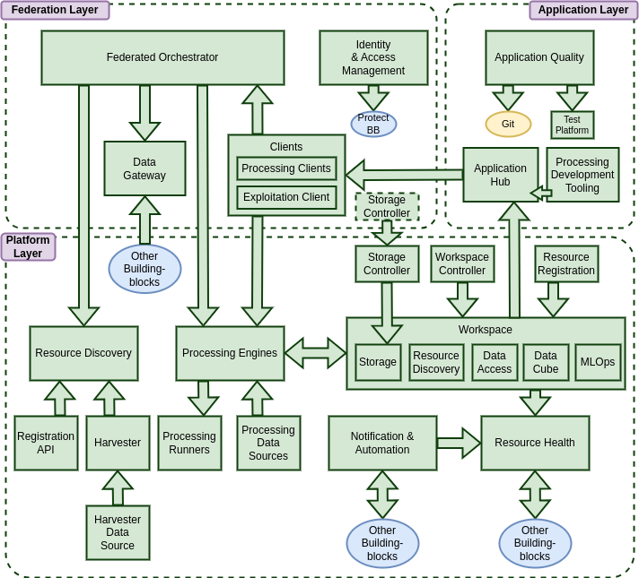

> __Customer__\: European Space Agency (ESA)

> __Programme__\: EOEPCA

> __Supply Chain__\: ESA > TELESPAZIO UK >  CS Group SPACE

# Context

Earth Observation (EO) data has quickly evolved into an indispensable resource, directly facilitating solutions for society's most pressing challenges. This intensifying influx of data, oftentimes distributed across multiple independent platforms, presents a significant challenge for end-users in efficiently accessing and collaborating on critical geospatial tasks. Nevertheless, these platforms are more commonly collocated with cloud computing resources and applications such that users are now able to perform geospatial analysis tasks remotely. Working in the cloud bypasses traditional download, storage and performance limitations, however the distributed nature of these platform networks introduces complexities in the free and collective access to this remote geospatial data.

CS Group responsabilities for EO Platform Interoperable Building Block Evolution Framework are as follows:
* Design, Development, Integration, Maintenance

The features are as follows:
* The features are centered around the capabilities offered by the Building Blocks themselves.
	* Centralized authentication management
	* Data search, cataloging and preparation
	* Processing system
	* Cloud storage, private or per group
	* Management of AI models and their datasets, as well as training tracking.

# Project implementation

The project objectives are as follows:
* Enhance interoperability across platforms for geospatial analysis by defining open standards and best practices.
* Develop open-source "Building Blocks" for EO Exploitation Platforms.
* Enable users to easily collaborate on geospatial analysis tasks at source.

The processes for carrying out the project are:
* Agile

# Technical characteristics

The solution key points are as follows:
* Reusable services, with open standard interfaces, that provide an exploitation platform solution.
* More at: https://eoepca.readthedocs.io/projects/architecture/en/latest/reference-architecture/high-level-architecture/

The main technologies used in this project are:

{:class="table table-bordered table-dark"}
| Domain | Technology(ies) |
|--------|----------------|
|Hardware environment(s)|Cloud, Docker, Kubernetes, S3, Minio|
|Operating System(s)|Linux, Windows|
|Programming language(s)|Javascript, Python, Java, C++, Shell|
|Interoperability (protocols, format, APIs)|REST, CWL, OGC, STAC|
|Production software (IDE, DEVOPS etc.)|Git, GitHub, Kubernetes, ArgoCD, FastAPI, Vue|
|Main COTS library(ies)|Docker, Helm, Kubernetes, Keycloak, Jupyter, JupyterHub, MLflow, SharingHub|

{::comment}Abbreviations{:/comment}

*[CLI]: Command Line Interface
*[IaC]: Infrastructure as Code
*[PaaS]: Platform as a Service
*[VM]: Virtual Machine
*[OS]: Operating System
*[IAM]: Identity and Access Management
*[SIEM]: Security Information and Event Management
*[SSO]: Single Sign On
*[IDS]: intrusion detection
*[IPS]: intrusion prevention
*[NSM]: network security monitoring
*[DRMAA]: Distributed Resource Management Application API is a high-level Open Grid Forum API specification for the submission and control of jobs to a Distributed Resource Management (DRM) system, such as a Cluster or Grid computing infrastructure.
